# Backend Simplification Plan: Modern Pydantic AI Architecture

## Overview

This plan transforms the current complex backend architecture into a simplified, modern Pydantic AI-powered system that directly integrates MCP tools and maintains specialized agent capabilities while drastically reducing complexity.

## Current State vs Target State

### Current Architecture Issues

- **Complex Agent Orchestration**: 7+ specialized agents with manual orchestration
- **Indirect MCP Integration**: Custom HTTP client to localhost:7779/indexer
- **Over-engineered Pipeline System**: Complex strategy pattern with multiple inheritance
- **Scattered Tool Management**: Tools spread across multiple files and classes

### Target Architecture Benefits

- **Single Agent Factory**: One agent handles all documentation types via dynamic prompts
- **Direct MCP Integration**: Native MCP tools via `mcp_servers` parameter
- **Simplified Pipeline**: Linear step execution with clear progress tracking
- **Centralized Tool Management**: All tools registered in one location

## Architecture Transformation

```mermaid
graph TB
    subgraph "🎯 Current Complex Architecture"
        direction TB

        subgraph "Multiple Agents"
            A1[SystemOverviewAgent]
            A2[ComponentAnalysisAgent]
            A3[APIOverviewAgent]
            A4[MaintenanceOpsAgent]
            A5[DevelopmentGuideAgent]
            A6[CodeDocumentationAgent]
            A7[DocsAgent]
        end

        subgraph "Custom MCP Integration"
            HTTP[HTTP Client]
            CS[CodeSearch Class]
            INDEXER[localhost:7779/indexer]
        end

        subgraph "Complex Pipeline"
            STRAT[Strategy Pattern]
            BASIC[BasicStrategy]
            API[APIStrategy]
            STEPS[Multi-Step Execution]
        end

        A1 --> HTTP
        A2 --> HTTP
        A3 --> HTTP
        A4 --> HTTP
        A5 --> HTTP
        A6 --> HTTP
        A7 --> HTTP
        HTTP --> CS
        CS --> INDEXER

        STRAT --> BASIC
        STRAT --> API
        BASIC --> STEPS
        API --> STEPS
    end

    subgraph "🚀 Target Simplified Architecture"
        direction TB

        subgraph "Single Agent Factory"
            FACTORY[DocumentationAgentFactory]
            AGENT[PydanticAI Agent]
            DYNAMIC[Dynamic System Prompts]
        end

        subgraph "Direct MCP Integration"
            MCP_TOOLS[MCP Tools via mcp_servers]
            SEARCH[mcp_search_code]
            ENTITIES[mcp_find_entities]
            RELATIONS[mcp_get_entity_relationships]
            QA[mcp_qa_codebase]
        end

        subgraph "Simplified Pipeline"
            LINEAR[Linear Step Execution]
            PROGRESS[Progress Tracking]
            RESULTS[Structured Results]
        end

        FACTORY --> AGENT
        AGENT --> DYNAMIC
        AGENT --> MCP_TOOLS
        MCP_TOOLS --> SEARCH
        MCP_TOOLS --> ENTITIES
        MCP_TOOLS --> RELATIONS
        MCP_TOOLS --> QA

        LINEAR --> PROGRESS
        PROGRESS --> RESULTS
    end
```



## Implementation Phases

| Phase                                      | Description                                           | Key Components                                                                                                                             | Files to Modify                                                                                            | Expected Outcome                                               | Effort        |
| ------------------------------------------ | ----------------------------------------------------- | ------------------------------------------------------------------------------------------------------------------------------------------ | ---------------------------------------------------------------------------------------------------------- | -------------------------------------------------------------- | ------------- |
| **Phase 1: Modern Pydantic AI Foundation** | Replace complex agent system with single modern agent | • Install `pydantic-ai`<br>• Create `DocumentationAgentFactory`<br>• Implement MCP server connection<br>• Basic agent with dynamic prompts | • `api/requirements.txt`<br>• `api/agents/core.py` (new)<br>• `api/agents/__init__.py` (new)               | Single agent replaces 7+ agents<br>85% reduction in agent code | **2-3 hours** |
| **Phase 2: Direct MCP Integration**        | Replace HTTP client with native MCP tools             | • Remove `CodeSearch` class<br>• Integrate MCP tools directly<br>• Update tool registration                                                | • `api/utils/tools.py`<br>• `api/routers/agents.py`<br>• Remove HTTP client code                           | Native MCP tool access<br>Eliminate localhost dependency       | **1-2 hours** |
| **Phase 3: Simplified Pipeline System**    | Replace strategy pattern with linear execution        | • Remove strategy classes<br>• Implement linear pipeline<br>• Add progress tracking                                                        | • `api/documentation/strategies/` (remove)<br>• `api/pipelines/core.py` (new)<br>• `api/routers/agents.py` | 70% reduction in pipeline code<br>Clear progress tracking      | **2-3 hours** |
| **Phase 4: Enhanced Tool Management**      | Centralize and optimize tool usage                    | • Consolidate tool definitions<br>• Add tool result validation<br>• Implement tool chaining                                                | • `api/tools/` (new directory)<br>• `api/agents/core.py`                                                   | Centralized tool management<br>Better error handling           | **1-2 hours** |
| **Phase 5: API Simplification**            | Streamline API endpoints and responses                | • Simplify router logic<br>• Update response models<br>• Remove unused endpoints                                                           | • `api/routers/agents.py`<br>• `api/routers/documentation.py`<br>• `api/utils/models.py`                   | Cleaner API surface<br>Faster response times                   | **1-2 hours** |

## Technical Implementation Details

### Phase 1: Modern Pydantic AI Foundation

#### Install Dependencies

```bash
pip install pydantic-ai mcp-client
```

#### Create Agent Factory (`api/agents/core.py`)

```python
from pydantic_ai import Agent, RunContext
from pydantic import BaseModel
from typing import Dict, Any, List
import os

class DocumentationDependencies(BaseModel):
    repository_name: str
    documentation_type: str
    user_query: str

class DocumentationResult(BaseModel):
    content: str
    metadata: Dict[str, Any]
    confidence: float
    sources: List[str]

class DocumentationAgentFactory:
    """Factory for creating documentation agents with MCP integration"""

    def __init__(self):
        self.agent = Agent(
            'openai:gpt-4o',
            deps_type=DocumentationDependencies,
            result_type=DocumentationResult,
            # Direct MCP server integration
            mcp_servers=[
                {
                    'name': 'codebase-tools',
                    'url': 'http://localhost:8009/sse/',
                    'tools': [
                        'mcp_search_code',
                        'mcp_find_entities',
                        'mcp_get_entity_relationships',
                        'mcp_qa_codebase'
                    ]
                }
            ]
        )

    @property
    def system_prompt(self) -> str:
        return """You are a specialized documentation agent with access to powerful MCP tools.

        Available Tools:
        - mcp_search_code: Search for code patterns and implementations
        - mcp_find_entities: Discover functions, classes, and files
        - mcp_get_entity_relationships: Map dependencies and relationships
        - mcp_qa_codebase: Get holistic codebase insights

        Your task: Generate comprehensive documentation based on the requested type.
        Always use multiple tools to cross-validate findings and provide complete coverage."""

    def create_specialized_agent(self, doc_type: str) -> Agent:
        """Create agent with specialized system prompt based on documentation type"""

        specialized_prompts = {
            'system_overview': """Focus on high-level architecture, main components, and system design.
            Use mcp_find_entities to map overall structure, then mcp_qa_codebase for architectural insights.""",

            'component_analysis': """Analyze specific components, their responsibilities, and interactions.
            Use mcp_search_code to find implementations, then mcp_get_entity_relationships for dependencies.""",

            'api_overview': """Document API endpoints, request/response patterns, and integration points.
            Search for API routes, controllers, and middleware using mcp_search_code.""",

            'maintenance_ops': """Focus on deployment, monitoring, and operational aspects.
            Look for configuration files, scripts, and operational documentation.""",

            'development_guide': """Create developer onboarding and contribution guidelines.
            Analyze project structure, setup requirements, and development workflows.""",

            'code_documentation': """Generate inline code documentation and explanations.
            Use mcp_search_code for specific functions, then explain their purpose and usage."""
        }

        # Create specialized agent with dynamic system prompt
        specialized_agent = Agent(
            'openai:gpt-4o',
            deps_type=DocumentationDependencies,
            result_type=DocumentationResult,
            system_prompt=f"{self.system_prompt}\n\nSpecialization: {specialized_prompts.get(doc_type, 'General documentation')}"
        )

        return specialized_agent
```

### Phase 2: Direct MCP Integration

#### Remove Old HTTP Client Pattern

```python
# REMOVE: api/utils/tools.py - CodeSearch class
# REMOVE: HTTP client instantiation in routers
# REMOVE: localhost:7779 dependency
```

#### Implement Direct MCP Tools

```python
@agent.tool
async def search_codebase(ctx: RunContext[DocumentationDependencies], query: str) -> Dict[str, Any]:
    """Search codebase using MCP tools"""
    # Direct MCP tool call - no HTTP client needed
    return await ctx.call_mcp_tool('mcp_search_code', {
        'query': query,
        'repo_name': ctx.deps.repository_name,
        'limit': 10
    })

@agent.tool
async def find_entities(ctx: RunContext[DocumentationDependencies], entity_type: str = '') -> Dict[str, Any]:
    """Find code entities using MCP tools"""
    return await ctx.call_mcp_tool('mcp_find_entities', {
        'repo_name': ctx.deps.repository_name,
        'entity_type': entity_type,
        'limit': 20
    })

@agent.tool
async def get_relationships(ctx: RunContext[DocumentationDependencies], entity_id: str) -> Dict[str, Any]:
    """Get entity relationships using MCP tools"""
    return await ctx.call_mcp_tool('mcp_get_entity_relationships', {
        'repo_name': ctx.deps.repository_name,
        'entity_id': entity_id,
        'max_depth': 2
    })

@agent.tool
async def qa_codebase(ctx: RunContext[DocumentationDependencies], question: str) -> Dict[str, Any]:
    """Get comprehensive codebase insights"""
    return await ctx.call_mcp_tool('mcp_qa_codebase', {
        'question': question,
        'repo_name': ctx.deps.repository_name,
        'include_diagrams': True
    })
```

### Phase 3: Simplified Pipeline System

#### Create Linear Pipeline (`api/pipelines/core.py`)

```python
from enum import Enum
from typing import List, Dict, Any, Optional
from pydantic import BaseModel
import asyncio

class PipelineStep(BaseModel):
    name: str
    description: str
    tool_calls: List[str]
    estimated_duration: int  # seconds

class PipelineStatus(str, Enum):
    PENDING = "pending"
    RUNNING = "running"
    COMPLETED = "completed"
    FAILED = "failed"

class PipelineResult(BaseModel):
    step_name: str
    status: PipelineStatus
    result: Optional[Dict[str, Any]] = None
    error: Optional[str] = None
    duration: Optional[int] = None

class DocumentationPipeline:
    """Simplified linear pipeline for documentation generation"""

    def __init__(self, agent_factory: DocumentationAgentFactory):
        self.agent_factory = agent_factory
        self.steps = self._define_steps()

    def _define_steps(self) -> Dict[str, List[PipelineStep]]:
        """Define pipeline steps for each documentation type"""
        return {
            'system_overview': [
                PipelineStep(
                    name="discover_architecture",
                    description="Discover overall system architecture",
                    tool_calls=["find_entities", "qa_codebase"],
                    estimated_duration=30
                ),
                PipelineStep(
                    name="analyze_components",
                    description="Analyze main system components",
                    tool_calls=["search_codebase", "get_relationships"],
                    estimated_duration=45
                ),
                PipelineStep(
                    name="generate_overview",
                    description="Generate comprehensive system overview",
                    tool_calls=["qa_codebase"],
                    estimated_duration=60
                )
            ],
            'api_overview': [
                PipelineStep(
                    name="find_api_endpoints",
                    description="Discover API endpoints and routes",
                    tool_calls=["search_codebase"],
                    estimated_duration=20
                ),
                PipelineStep(
                    name="analyze_request_response",
                    description="Analyze request/response patterns",
                    tool_calls=["search_codebase", "get_relationships"],
                    estimated_duration=40
                ),
                PipelineStep(
                    name="document_api",
                    description="Generate API documentation",
                    tool_calls=["qa_codebase"],
                    estimated_duration=50
                )
            ]
        }

    async def execute_pipeline(
        self,
        doc_type: str,
        repository_name: str,
        user_query: str,
        progress_callback: Optional[callable] = None
    ) -> List[PipelineResult]:
        """Execute pipeline with progress tracking"""

        if doc_type not in self.steps:
            raise ValueError(f"Unknown documentation type: {doc_type}")

        agent = self.agent_factory.create_specialized_agent(doc_type)
        steps = self.steps[doc_type]
        results = []

        for i, step in enumerate(steps):
            if progress_callback:
                progress_callback(i, len(steps), step.name)

            try:
                # Execute step using agent
                result = await agent.run(
                    user_query,
                    deps=DocumentationDependencies(
                        repository_name=repository_name,
                        documentation_type=doc_type,
                        user_query=f"Execute {step.name}: {step.description}"
                    )
                )

                results.append(PipelineResult(
                    step_name=step.name,
                    status=PipelineStatus.COMPLETED,
                    result=result.data.model_dump(),
                    duration=step.estimated_duration
                ))

            except Exception as e:
                results.append(PipelineResult(
                    step_name=step.name,
                    status=PipelineStatus.FAILED,
                    error=str(e)
                ))
                break

        return results
```

### Phase 4: Enhanced Tool Management

#### Centralized Tool Registry (`api/tools/registry.py`)

```python
from typing import Dict, List, Callable, Any
from pydantic_ai import Agent

class ToolRegistry:
    """Centralized registry for all MCP tools"""

    def __init__(self):
        self.tools: Dict[str, Callable] = {}
        self.tool_metadata: Dict[str, Dict[str, Any]] = {}

    def register_mcp_tools(self, agent: Agent) -> None:
        """Register all MCP tools with the agent"""

        # Core codebase analysis tools
        self._register_search_tools(agent)
        self._register_entity_tools(agent)
        self._register_analysis_tools(agent)

    def _register_search_tools(self, agent: Agent) -> None:
        """Register search-related MCP tools"""

        @agent.tool
        async def search_code_patterns(ctx, query: str, file_pattern: str = "") -> Dict[str, Any]:
            """Search for specific code patterns across the codebase"""
            return await ctx.call_mcp_tool('mcp_search_code', {
                'query': query,
                'repo_name': ctx.deps.repository_name,
                'limit': 15
            })

        @agent.tool
        async def search_documentation(ctx, query: str) -> Dict[str, Any]:
            """Search existing documentation and comments"""
            return await ctx.call_mcp_tool('mcp_search_code', {
                'query': f"documentation comment {query}",
                'repo_name': ctx.deps.repository_name,
                'limit': 10
            })

    def _register_entity_tools(self, agent: Agent) -> None:
        """Register entity discovery tools"""

        @agent.tool
        async def find_functions(ctx, name_pattern: str = "") -> Dict[str, Any]:
            """Find functions matching pattern"""
            return await ctx.call_mcp_tool('mcp_find_entities', {
                'repo_name': ctx.deps.repository_name,
                'entity_type': 'function',
                'name_pattern': name_pattern,
                'limit': 25
            })

        @agent.tool
        async def find_classes(ctx, name_pattern: str = "") -> Dict[str, Any]:
            """Find classes matching pattern"""
            return await ctx.call_mcp_tool('mcp_find_entities', {
                'repo_name': ctx.deps.repository_name,
                'entity_type': 'class',
                'name_pattern': name_pattern,
                'limit': 25
            })

    def _register_analysis_tools(self, agent: Agent) -> None:
        """Register analysis and insight tools"""

        @agent.tool
        async def analyze_architecture(ctx, focus_area: str = "") -> Dict[str, Any]:
            """Get architectural insights about the codebase"""
            question = f"What is the overall architecture of this codebase? Focus on: {focus_area}" if focus_area else "What is the overall architecture of this codebase?"
            return await ctx.call_mcp_tool('mcp_qa_codebase', {
                'question': question,
                'repo_name': ctx.deps.repository_name,
                'include_diagrams': True
            })

        @agent.tool
        async def trace_dependencies(ctx, entity_id: str, depth: int = 2) -> Dict[str, Any]:
            """Trace dependencies for a specific entity"""
            return await ctx.call_mcp_tool('mcp_get_entity_relationships', {
                'repo_name': ctx.deps.repository_name,
                'entity_id': entity_id,
                'max_depth': depth
            })
```

### Phase 5: API Simplification

#### Simplified Router (`api/routers/agents.py`)

```python
from fastapi import APIRouter, HTTPException, BackgroundTasks
from pydantic import BaseModel
from typing import Dict, Any, Optional
import asyncio

from ..agents.core import DocumentationAgentFactory
from ..pipelines.core import DocumentationPipeline
from ..tools.registry import ToolRegistry

router = APIRouter()

class DocumentationRequest(BaseModel):
    repository_name: str
    documentation_type: str
    user_query: str
    stream: bool = False

class DocumentationResponse(BaseModel):
    status: str
    results: List[Dict[str, Any]]
    metadata: Dict[str, Any]

# Initialize components
agent_factory = DocumentationAgentFactory()
pipeline = DocumentationPipeline(agent_factory)
tool_registry = ToolRegistry()

@router.post("/generate-documentation")
async def generate_documentation(
    request: DocumentationRequest,
    background_tasks: BackgroundTasks
) -> DocumentationResponse:
    """Generate documentation using simplified pipeline"""

    try:
        # Execute pipeline
        results = await pipeline.execute_pipeline(
            doc_type=request.documentation_type,
            repository_name=request.repository_name,
            user_query=request.user_query
        )

        return DocumentationResponse(
            status="completed",
            results=[r.model_dump() for r in results],
            metadata={
                "total_steps": len(results),
                "completed_steps": len([r for r in results if r.status == "completed"]),
                "documentation_type": request.documentation_type
            }
        )

    except Exception as e:
        raise HTTPException(status_code=500, detail=str(e))

@router.get("/pipeline-status/{pipeline_id}")
async def get_pipeline_status(pipeline_id: str) -> Dict[str, Any]:
    """Get status of running pipeline"""
    # Implementation for pipeline status tracking
    pass

@router.get("/available-tools")
async def get_available_tools() -> Dict[str, Any]:
    """Get list of available MCP tools"""
    return {
        "mcp_tools": [
            "mcp_search_code",
            "mcp_find_entities",
            "mcp_get_entity_relationships",
            "mcp_qa_codebase"
        ],
        "agent_tools": list(tool_registry.tools.keys())
    }
```

## Success Metrics

### Code Reduction Targets

- **Agent Definitions**: 85% reduction (7+ agents → 1 factory)
- **Pipeline Complexity**: 70% reduction (strategy pattern → linear execution)
- **Tool Integration**: 90% reduction (HTTP client → direct MCP)
- **API Endpoints**: 50% reduction (consolidate similar endpoints)

### Performance Improvements

- **Response Time**: 40% faster (eliminate HTTP overhead)
- **Error Handling**: 60% better (native MCP error handling)
- **Tool Discovery**: Automatic (no manual tool registration)
- **Memory Usage**: 30% reduction (fewer agent instances)

## Migration Strategy

### Database Compatibility

- **Maintain existing chat/message tables**
- **Keep current API contracts for frontend**
- **Preserve user sessions and history**
- **Add new fields for pipeline tracking**

### Rollback Plan

- **Keep current code in separate branch**
- **Feature flags for gradual rollout**
- **Database migration scripts**
- **Monitoring and alerting for new system**

## Documentation Requirements

### Updated Architecture Diagrams

- **System overview with new agent architecture**
- **MCP tool integration flow**
- **Simplified pipeline execution**
- **API endpoint consolidation**

### Developer Documentation

- **Migration guide for team members**
- **New agent development patterns**
- **MCP tool usage examples**
- **Testing strategies for new architecture**

## Risk Assessment

### High Risk Items

- **MCP Server Availability**: Direct dependency on localhost:8009
- **Tool Compatibility**: Ensure all MCP tools work as expected
- **Performance Impact**: Monitor response times during migration

### Mitigation Strategies

- **Fallback Mechanisms**: Implement graceful degradation
- **Comprehensive Testing**: Unit and integration tests
- **Gradual Rollout**: Phase-by-phase deployment
- **Monitoring**: Real-time performance tracking

## Conclusion

This plan transforms the backend from a complex, over-engineered system into a modern, efficient Pydantic AI architecture. By leveraging the latest Pydantic AI patterns and direct MCP integration, we achieve:

1. **Massive Code Reduction**: 85% fewer agent definitions
2. **Simplified Architecture**: Linear pipeline execution
3. **Better Performance**: Direct MCP tool access
4. **Enhanced Maintainability**: Centralized tool management
5. **Future-Proof Design**: Built on modern Pydantic AI patterns

The implementation follows the [official Pydantic AI documentation](https://ai.pydantic.dev/api/agent/) and incorporates best practices from the [MCP integration guide](https://ai.pydantic.dev/mcp/client/), ensuring we're building on solid, well-documented foundations.
