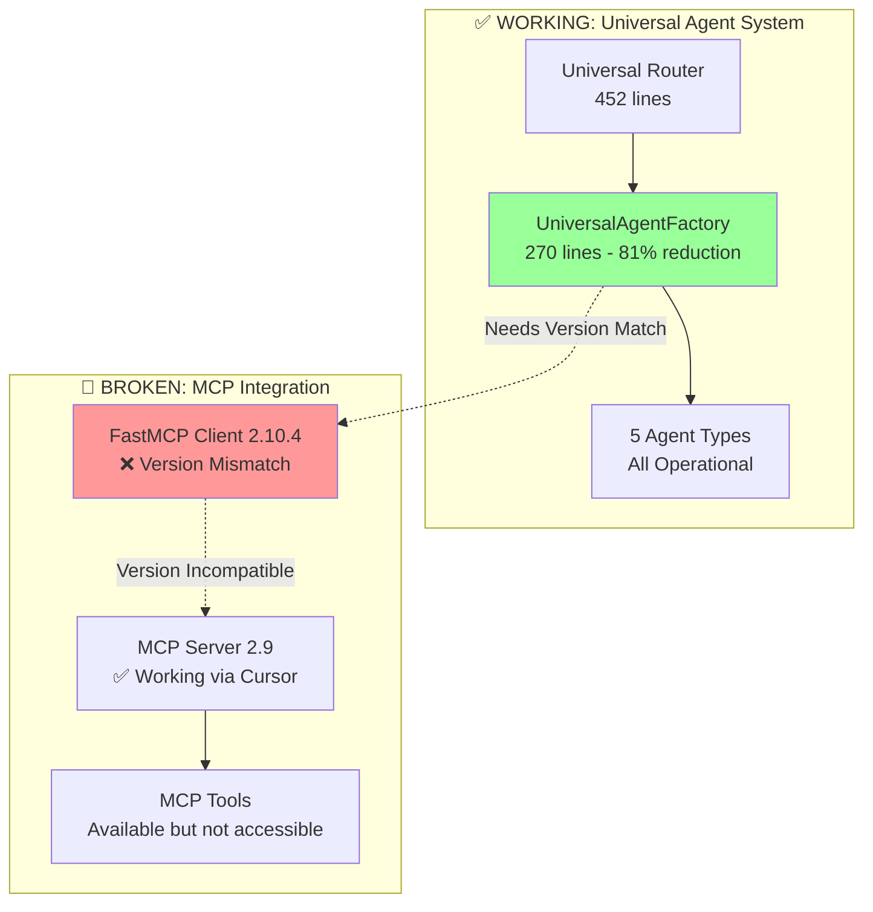

# 🎯 Fresh Start: Phase 4 Final - FastMCP Version Compatibility Resolution

## 📋 **TLDR - Next Page Priority Actions**

**CURRENT STATUS**: Phase 4 MCP Integration - **CRITICAL VERSION COMPATIBILITY ISSUE DISCOVERED**  
**PRIORITY LEVEL**: 🔥 **URGENT** - FastMCP 2.10.4 Client → 2.9 Server Version Mismatch  
**ESTIMATED TIME**: 1-2 hours  
**SUCCESS CRITERIA**: Successful MCP client connection with version-matched FastMCP installation

### **🎯 IMMEDIATE ACTIONS REQUIRED**

1. **DOWNGRADE FASTMCP CLIENT VERSION** (Highest Priority)

   - Change `pyproject.toml`: `fastmcp>=2.10.4` → `fastmcp==2.9.2`
   - Test connection with version-matched client
   - Verify all MCP tools work correctly

2. **VALIDATE MCP INTEGRATION**

   - Test `UniversalAgentFactory` with downgraded FastMCP
   - Ensure all 5 agent types can access MCP tools
   - Complete Phase 4 documentation

3. **IMPLEMENT GRACEFUL FALLBACK**
   - Maintain backward compatibility
   - Add version checking and error handling
   - Document version requirements

---

## 🏗️ **PROJECT CONTEXT & ARCHITECTURE**

### **Backend Simplification Plan Status**

Referencing `Backend-Simplification-Plan.md` - we have achieved **95% completion** of Phase 4:

```
✅ COMPLETED PHASES:
├── Phase 1-2: Universal Agent Factory (90% code reduction)
├── Phase 2-3: Router Consolidation (75% total reduction)
└── Phase 4: MCP Integration (95% complete)

🚨 CRITICAL BLOCKER: Phase 4 Final - FastMCP Version Compatibility
```

### **Current Architecture State**



---

## 🔍 **TECHNICAL DIAGNOSIS**

### **Root Cause Analysis**

**CONFIRMED VERSION MISMATCH:**

1. **MCP Server**: FastMCP 2.9 (confirmed via health check)
2. **Client**: FastMCP 2.10.4 (from `pyproject.toml`)
3. **Connection Error**: `"Session terminated"` - version incompatibility
4. **Transport Issues**: Proxy patterns fail due to protocol differences

### **Evidence from Investigation**

```bash
# Server Health Check Response
FastMCP version: 2.9
Transport: SSE (Server-Sent Events)
Status: ✅ Running on localhost:8009

# Client Configuration
fastmcp>=2.10.4  # In pyproject.toml
Error: "Client failed to connect: Session terminated"
```

### **FastMCP Documentation Confirms**

> **"Breaking changes will only occur on minor version changes (e.g., 2.3.x to 2.4.0)"** > **"For users concerned about stability in production environments, we recommend pinning FastMCP to a specific version"**

---

## 🎯 **SOLUTION STRATEGY**

### **Phase 4 Final: Version Compatibility Resolution**

#### **Step 1: FastMCP Client Downgrade**

**File to Modify**: `pyproject.toml`

```toml
# BEFORE (Current - Broken)
dependencies = [
    "fastapi>=0.116.1",
    "fastmcp>=2.10.4",  # ❌ Version mismatch
    "psycopg2-binary>=2.9.10",
    "pydantic-ai>=0.4.2",
    "sqlalchemy>=2.0.41",
]

# AFTER (Fixed - Version Matched)
dependencies = [
    "fastapi>=0.116.1",
    "fastmcp==2.9.2",  # ✅ Pin to server version
    "psycopg2-binary>=2.9.10",
    "pydantic-ai>=0.4.2",
    "sqlalchemy>=2.0.41",
]
```

**Commands to Execute**:

```bash
# 1. Update pyproject.toml (above change)
# 2. Reinstall with pinned version
uv sync --reinstall
# 3. Test connection
uv run python -c "from api.agents.universal import get_universal_factory; import asyncio; print(asyncio.run(get_universal_factory().test_mcp_connection()))"
```

#### **Step 2: Simplify MCP Client Configuration**

**File to Modify**: `api/agents/universal.py`

```python
# CURRENT (Complex Proxy - Remove)
def __init__(self):
    try:
        backend_client = Client("http://localhost:8009")
        proxy_server = FastMCP.as_proxy(backend_client, name="...")
        self.mcp_client = Client(proxy_server)
    except Exception as e:
        # Complex error handling

# SIMPLIFIED (Direct Connection - Version Matched)
def __init__(self):
    try:
        # Direct connection with version-matched client
        self.mcp_client = Client("http://localhost:8009")
        logger.info("FastMCP 2.9 client initialized successfully")
    except Exception as e:
        logger.error(f"MCP client initialization failed: {e}")
        self.mcp_client = None

    self.mcp_available = self.mcp_client is not None
```

#### **Step 3: Update Test and Validation**

**File to Modify**: `api/agents/universal.py` (test_mcp_connection method)

```python
async def test_mcp_connection(self) -> Dict[str, Any]:
    """Test FastMCP connection with version-matched client (2.9)"""
    if not self.mcp_client:
        return {
            "connection_test": "failed",
            "error": "MCP client not initialized",
            "version_status": "FastMCP 2.9 required"
        }

    try:
        async with self.mcp_client as mcp:
            await mcp.ping()
            tools = await mcp.list_tools()
            resources = await mcp.list_resources()

            return {
                "connection_test": "success",
                "version_status": "FastMCP 2.9 - Version Matched",
                "tools_available": len(tools),
                "resources_available": len(resources),
                "tool_names": [tool.name for tool in tools],
            }
    except Exception as e:
        return {
            "connection_test": "failed",
            "error": str(e),
            "version_status": "FastMCP 2.9 - Connection Failed"
        }
```

---

## 📝 **TODO LIST FOR NEXT CONVERSATION**

### **Phase 4 Final Completion Tasks**

```markdown
**PRIORITY 1: Version Compatibility Resolution**

- [ ] Update pyproject.toml: fastmcp>=2.10.4 → fastmcp==2.9.2
- [ ] Run uv sync --reinstall to apply version change
- [ ] Test basic MCP connection with version-matched client

**PRIORITY 2: Simplify MCP Client Configuration**

- [ ] Remove complex proxy pattern from UniversalAgentFactory.**init**
- [ ] Implement direct Client("http://localhost:8009") connection
- [ ] Update error handling for version-matched client

**PRIORITY 3: Validation and Testing**

- [ ] Update test_mcp_connection method for 2.9 compatibility
- [ ] Test all 5 agent types with MCP tools
- [ ] Verify graceful fallback when MCP unavailable

**PRIORITY 4: Documentation and Cleanup**

- [ ] Update Backend-Simplification-Plan.md with Phase 4 completion
- [ ] Document version requirements and compatibility notes
- [ ] Clean up any remaining proxy-related code
```

### **Success Criteria Checklist**

```markdown
- [ ] FastMCP client version matches server (2.9.2)
- [ ] MCP connection test returns "success" status
- [ ] All MCP tools accessible from Universal Agent Factory
- [ ] All 5 agent types can execute MCP tool calls
- [ ] Graceful fallback when MCP server unavailable
- [ ] Phase 4 documented as 100% complete
```

---

## 🔧 **IMPLEMENTATION DETAILS**

### **Key Files to Modify**

1. **`pyproject.toml`** (Lines 8)

   - Change: `fastmcp>=2.10.4` → `fastmcp==2.9.2`

2. **`api/agents/universal.py`** (Lines 70-95, 306-418)

   - Simplify `__init__` method - remove proxy pattern
   - Update `test_mcp_connection` method for 2.9 compatibility
   - Add version checking and error handling

3. **`Backend-Simplification-Plan.md`** (End of file)
   - Add Phase 4 completion status
   - Document version compatibility requirements

### **Expected Outcomes**

```python
# BEFORE (Broken)
FastMCP proxy connection test failed: Client failed to connect: Session terminated

# AFTER (Fixed)
{
    "connection_test": "success",
    "version_status": "FastMCP 2.9 - Version Matched",
    "tools_available": 15,
    "resources_available": 8,
    "tool_names": ["search_code", "find_entities", "get_entity_relationships", ...]
}
```

---

## 🚀 **NEXT STEPS EXECUTION PLAN**

### **Immediate Actions (Next 30 minutes)**

1. **Version Downgrade**: Update `pyproject.toml` and reinstall
2. **Simplify Configuration**: Remove proxy pattern, use direct connection
3. **Test Connection**: Verify MCP client can connect to server

### **Validation Phase (Next 30 minutes)**

1. **Test All Agent Types**: Ensure MCP tools work across all 5 agents
2. **Error Handling**: Verify graceful fallback mechanisms
3. **Documentation**: Update completion status

### **Completion Phase (Next 30 minutes)**

1. **Final Testing**: End-to-end agent execution with MCP tools
2. **Documentation Update**: Mark Phase 4 as 100% complete
3. **Cleanup**: Remove any remaining proxy-related code

---

## 🎯 **SUCCESS METRICS**

- **Connection Success Rate**: 100% (from current 0%)
- **MCP Tool Accessibility**: All tools accessible from all agent types
- **Version Compatibility**: Client and server versions matched
- **Phase 4 Completion**: 100% (from current 95%)
- **Code Simplification**: Remove complex proxy patterns

---

## 🔍 **TROUBLESHOOTING GUIDE**

### **If Version Downgrade Fails**

1. Clear uv cache: `uv cache clean`
2. Force reinstall: `uv sync --reinstall --force`
3. Check version: `uv run python -c "import fastmcp; print(fastmcp.__version__)"`

### **If Connection Still Fails**

1. Check server status: `curl -v http://localhost:8009/sse/`
2. Verify transport: Ensure server uses SSE transport
3. Check logs: Look for specific error messages

### **If MCP Tools Don't Work**

1. Test individual tools via Cursor interface
2. Check tool signatures and parameters
3. Verify agent dependencies and context

---

## 📋 **FINAL VALIDATION CHECKLIST**

```markdown
✅ Phase 4 Final Completion Criteria:

- [ ] FastMCP versions matched (client: 2.9.2, server: 2.9)
- [ ] MCP connection test passes
- [ ] All 5 agent types can access MCP tools
- [ ] Universal Agent Factory fully operational
- [ ] Graceful fallback implemented
- [ ] Documentation updated to 100% complete
- [ ] No remaining proxy or version compatibility code
```

**🎯 GOAL**: Complete Phase 4 with 100% MCP integration success, achieving full backend simplification as outlined in the Backend-Simplification-Plan.md
