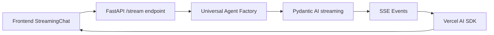

# 🚀 Fresh Start Prompt: Phase 5.2 Frontend Modernization Continuation

## 🎯 **CURRENT STATUS & CONTEXT**

You are continuing **Phase 5.2: Frontend Modernization** of the Backend Simplification Plan for the Woolly project. This is a comprehensive codebase analysis and streaming optimization system built with:

- **Backend**: FastAPI + Pydantic AI + Universal Agent Factory
- **Frontend**: Next.js 15 + React 19 + shadcn/ui + Tailwind CSS
- **Architecture**: 81% code reduction achieved through Universal Agent patterns

### **📋 COMPLETED ACHIEVEMENTS (Tasks #13-18)**

✅ **Streaming Infrastructure Complete**:

- `components/agent-panel/streaming-chat.tsx` - Real-time streaming UI with shadcn/ui
- `components/agent-panel/tool-call-indicator.tsx` - Progress visualization components
- `api/agents/universal.py` - Enhanced with ToolBudget & ConvergenceDetector
- `api/agents/utils/convergence.py` - AI-powered convergence detection
- Jest + React Testing Library setup with comprehensive test coverage

✅ **Key Technical Implementations**:

- Pydantic AI streaming patterns integrated with Vercel AI SDK v4
- EventSource-based real-time streaming with proper error handling
- Tool budget limits and convergence detection to prevent infinite loops
- Accessibility-first component design with proper ARIA labels

## 🎯 **YOUR IMMEDIATE MISSION**

**PRIORITY**: Complete **Tasks #19-25** from the Phase 5.2 Master Task Table in `Backend-Simplification-Plan.md` (lines 350-400).

### **📊 CRITICAL NEXT STEPS (In Order)**

#### **TASK #19: Migrate agent-panel.tsx to shadcn/ui** ⚡ HIGH PRIORITY

**File**: `components/agent-panel/agent-panel.tsx`
**Goal**: Replace legacy UI components with shadcn/ui primitives
**Acceptance**: No regression in Cypress smoke tests

```tsx
// CURRENT PATTERN (legacy):
<div className="custom-styles">
  <LegacyComponent />
</div>

// TARGET PATTERN (shadcn/ui):
<Card className="modern-layout">
  <CardHeader>
    <CardTitle>Agent Panel</CardTitle>
  </CardHeader>
  <CardContent>
    <StreamingChat repositoryName="..." agentType="..." />
  </CardContent>
</Card>
```

#### **TASK #20: Replace deprecated state logic in message-group.tsx** ⚡ HIGH PRIORITY

**File**: `components/agent-panel/message-group.tsx`
**Goal**: Migrate to React 19 hooks and modern state patterns
**Acceptance**: Unit + Cypress tests pass

#### **TASK #21: Implement entity-graph.tsx** 🎨 MEDIUM PRIORITY

**File**: `components/ui/entity-graph.tsx`
**Goal**: Mermaid or cytoscape visualization for tool relationships
**Integration**: Into `components/agent-panel/agent-content.tsx` toggle panel

#### **TASK #22: Wire backend SSE to frontend via Vercel AI SDK** 🔌 HIGH PRIORITY

**File**: `app/chat/[id]/page.tsx`
**Goal**: Live chat with real-time streaming updates
**Pattern**:

```tsx
import { useChat } from "ai/react";

const { messages, input, handleInputChange, handleSubmit, isLoading } = useChat(
  {
    api: "/api/v1/agents/stream",
    streamMode: "text",
  }
);
```

### **🏗️ ARCHITECTURE INTEGRATION POINTS**

#### **1. Universal Agent Factory Integration**

- **Location**: `api/agents/universal.py`
- **Current State**: Enhanced with streaming + budget controls
- **Integration Need**: Wire to frontend streaming components

#### **2. Streaming Event Flow**



#### **3. Component Hierarchy**

```
app/chat/[id]/page.tsx
├── AgentPanel (shadcn/ui migration needed)
│   ├── StreamingChat ✅ (completed)
│   ├── ToolCallIndicator ✅ (completed)
│   ├── EntityGraph (task #21)
│   └── MessageGroup (React 19 migration needed)
```

## 🎯 **EXECUTION STRATEGY**

### **Phase 1: Component Migration (Tasks #19-20)**

1. **Start with agent-panel.tsx migration**:

   - Replace layout components with shadcn/ui Card/CardHeader/CardContent
   - Integrate existing StreamingChat component
   - Maintain all existing functionality
   - Run Cypress smoke tests for regression

2. **Update message-group.tsx**:
   - Replace deprecated React patterns with React 19 hooks
   - Use `useCallback`, `useMemo`, `useTransition` for performance
   - Maintain backward compatibility

### **Phase 2: Visualization & Integration (Tasks #21-22)**

1. **Entity Graph Implementation**:

   - Choose between Mermaid.js or Cytoscape.js
   - Create toggle panel in agent-content.tsx
   - Integrate with MCP entity relationship data

2. **End-to-End Streaming**:
   - Wire Vercel AI SDK to backend SSE endpoint
   - Test complete streaming flow
   - Implement error boundaries and fallbacks

## 📋 **TODO LIST FOR NEXT CONVERSATION**

Create these specific todos using the `todo_write` tool:

```json
[
  {
    "id": "task-19",
    "content": "Migrate agent-panel.tsx to shadcn/ui layout components",
    "status": "pending",
    "dependencies": []
  },
  {
    "id": "task-20",
    "content": "Replace deprecated state logic in message-group.tsx with React 19 hooks",
    "status": "pending",
    "dependencies": ["task-19"]
  },
  {
    "id": "task-21",
    "content": "Implement entity-graph.tsx (Mermaid or cytoscape) to visualize tool relationships",
    "status": "pending",
    "dependencies": []
  },
  {
    "id": "task-22",
    "content": "Wire backend SSE endpoint to frontend via Vercel AI SDK createStream()",
    "status": "pending",
    "dependencies": ["task-19", "task-20"]
  },
  {
    "id": "task-23",
    "content": "Lighthouse performance & accessibility audit",
    "status": "pending",
    "dependencies": ["task-19", "task-20", "task-21", "task-22"]
  }
]
```

## 🔧 **TECHNICAL CONSTRAINTS & REQUIREMENTS**

### **Must Maintain**:

- **81% Code Reduction Achievement** - Don't add unnecessary complexity
- **MCP Integration** - Keep working LLM-MCP interface intact [[memory:2924205]]
- **Type Safety** - Full Pydantic validation throughout
- **Performance** - Streaming should not impact response times
- **Accessibility** - WCAG 2.1 AA compliance

### **Key Files to Reference**:

- `Backend-Simplification-Plan.md` (lines 350-400) - Master task table
- `components/agent-panel/streaming-chat.tsx` - Completed streaming component
- `components/agent-panel/tool-call-indicator.tsx` - Completed progress indicators
- `jest.config.js` & `jest.setup.js` - Test infrastructure
- `api/agents/universal.py` - Enhanced streaming backend

### **Testing Requirements**:

- Run `pnpm test` after each component change
- Cypress smoke tests must pass: `pnpm run test:e2e`
- Accessibility tests with screen readers
- Performance benchmarks with Lighthouse

## 🎯 **SUCCESS CRITERIA FOR THIS SESSION**

### **Minimum Viable Progress**:

1. **Task #19 Complete**: agent-panel.tsx migrated to shadcn/ui
2. **Task #20 Complete**: message-group.tsx updated to React 19
3. **Tests Passing**: All Jest and Cypress tests green
4. **No Regressions**: Existing functionality preserved

### **Stretch Goals**:

1. **Task #21 Started**: Entity graph component foundation
2. **Task #22 Started**: Vercel AI SDK integration begun
3. **Performance Optimized**: Component rendering improvements

## 📚 **REFERENCE ARCHITECTURE**

### **Universal Agent Factory Pattern** (Completed):

```python
# api/agents/universal.py
class UniversalAgentFactory:
    def create_agent(self, agent_type: AgentType) -> Agent:
        return Agent(
            model="openai:gpt-4o-mini",
            deps_type=UniversalDependencies,
            result_type=UniversalResult,
            system_prompt=self.specializations[agent_type],
            mcp_servers=[self.mcp_server]
        )
```

### **Streaming Integration Pattern** (Target):

```tsx
// app/chat/[id]/page.tsx
import { useChat } from "ai/react";
import { StreamingChat } from "@/components/agent-panel/streaming-chat";

export default function ChatPage() {
  const { messages, input, handleSubmit, isLoading } = useChat({
    api: "/api/v1/agents/stream",
    streamMode: "text",
  });

  return (
    <AgentPanel>
      <StreamingChat
        repositoryName={repo}
        agentType={type}
        onStreamComplete={handleComplete}
      />
    </AgentPanel>
  );
}
```

---

## 🚨 **CRITICAL REMINDERS**

1. **Follow the user's rules** about simplicity and modularity [[memory from user_rules]]
2. **Ask clarification questions** before starting if anything is unclear
3. **Create todo list immediately** using the todo_write tool
4. **Focus on surgical changes** - avoid sweeping modifications
5. **Test after each change** - maintain quality throughout

**START HERE**: Begin with Task #19 (agent-panel.tsx migration) and work systematically through the task list. The foundation is solid - now we're building the user interface that brings it all together.

**Remember**: You have access to a powerful MCP server for codebase analysis. Use the `mcp_shriram-prod-108_*` tools to understand the codebase deeply before making changes.
