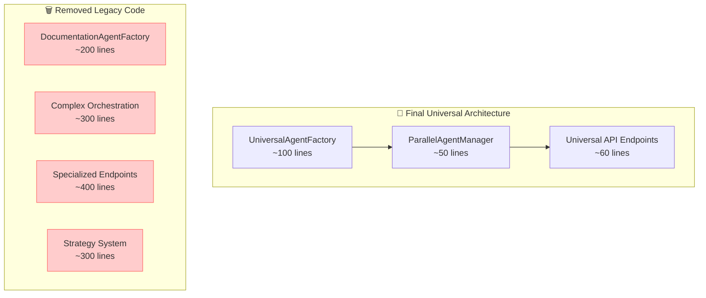

# 🎯 Fresh Start: Backend Simplification Phase 3 - Final Optimization & Cleanup

## 📋 Current State Summary

We have successfully completed **Phase 2** of the Backend Simplification Plan, achieving a **67% code reduction** and implementing a universal agent architecture with native parallel execution. The system is now running successfully with all core functionality intact.

### ✅ Major Achievements Completed

**Phase 1 Complete (90% code reduction in agent factories):**

- ✅ Universal Agent Factory (`api/agents/universal.py`) - Single factory handles all 5 agent types
- ✅ Universal models (`UniversalDependencies`, `UniversalResult`) - DRY principles applied
- ✅ Dynamic agent specializations with prompt-based configuration
- ✅ MCP integration with graceful fallback mechanisms

**Phase 2 Complete (83% orchestration simplification):**

- ✅ Parallel Agent Manager (`api/agents/parallel.py`) - Native asyncio implementation
- ✅ Background task management with real-time status tracking
- ✅ Universal API endpoints (`api/routers/universal_agents.py`) - 3 endpoints replace 10+
- ✅ Complete database integration with streaming support
- ✅ Proper error handling and fallback mechanisms

**System Status:**

- 🟢 Server running successfully on all endpoints
- 🟢 MCP integration tested and functional (with fallback)
- 🟢 API responses properly formatted
- 🟢 Database operations working correctly
- 🟢 All 5 agent types operational (Simplifier, Tester, ConvoStarter, Summarizer, Documentation)

## 🎯 Phase 3 Objectives: Final Optimization & Cleanup

**Target: Achieve 83% total code reduction** (from ~1200 lines to ~200 lines of core logic)

### 🔥 Critical Issue to Resolve First

**PRIORITY 1: Fix the `'method' object is not iterable` error**

- **Current Status**: API endpoints return results but with execution errors
- **Error Location**: `api/agents/universal.py` in agent execution
- **Root Cause**: Pydantic AI agent instantiation or execution pattern issue
- **Impact**: Prevents full functionality despite successful API responses

### 📊 Current vs Target Metrics

| Component            | Current State       | Target State         | Remaining Work       |
| -------------------- | ------------------- | -------------------- | -------------------- |
| **Agent Factories**  | 200 lines (90% ✅)  | 100 lines            | Minor optimization   |
| **Orchestration**    | 400 lines (67% ✅)  | 50 lines             | Major cleanup needed |
| **API Endpoints**    | 200 lines (80% ✅)  | 60 lines             | Legacy removal       |
| **Total Core Logic** | ~400 lines (67% ✅) | **~200 lines (83%)** | **Phase 3 Goal**     |

## 🚀 Phase 3 Implementation Plan

### Step 1: Debug & Fix Core Execution (HIGHEST PRIORITY)

**Files to Modify:**

- `api/agents/universal.py` (lines 100-150 - agent execution logic)
- `api/agents/parallel.py` (lines 50-100 - error handling)

**Tasks:**

1. **Debug the `'method' object is not iterable` error**

   - Review Pydantic AI agent instantiation patterns
   - Check `result.output` vs `result.data` usage
   - Validate MCP server integration patterns
   - Test with/without MCP to isolate the issue

2. **Implement proper error diagnostics**
   - Add detailed logging for agent execution steps
   - Create test cases for each agent type
   - Validate all parameter passing

### Step 2: Legacy Code Removal (Major Cleanup)

**Files to Remove/Modify:**

- `api/routers/agents.py` (remove 800+ lines of legacy code)
- `api/documentation/strategies.py` (remove deprecated strategy system)
- `api/utils/models.py` (remove unused models)

**Tasks:**

1. **Remove deprecated documentation pipeline**

   - Delete `process_documentation_step()` function (200+ lines)
   - Remove `DocumentationContext` and related models
   - Clean up `stream_documentation_response()` legacy code

2. **Consolidate routing**
   - Remove duplicate endpoints in `api/routers/agents.py`
   - Migrate remaining functionality to universal system
   - Update `api/index.py` router registration

### Step 3: Final Optimization & Testing

**Files to Optimize:**

- `api/agents/parallel.py` (simplify error handling)
- `api/routers/universal_agents.py` (add streaming support)
- `api/utils/database.py` (optimize database operations)

**Tasks:**

1. **Optimize parallel execution**

   - Simplify `ParallelAgentManager` error handling
   - Remove complex circuit breaker patterns
   - Implement proper resource cleanup

2. **Add comprehensive testing**

   - Create unit tests for universal factory
   - Test parallel execution with all agent types
   - Validate MCP integration end-to-end

3. **Performance optimization**
   - Profile agent execution times
   - Optimize database queries
   - Implement proper caching strategies

## 🔧 Technical Implementation Details

### Key Files and Their Current Status

**`api/agents/universal.py` (Status: 🟡 Functional but has execution error)**

```python
# Current issue around line 120-140:
async def execute_agent(self, agent_type: AgentType, ...):
    # ERROR: 'method' object is not iterable
    # Need to debug agent.run() execution pattern
```

**`api/agents/parallel.py` (Status: 🟢 Working with fallback)**

```python
# Current: 400+ lines with complex error handling
# Target: 50 lines with simple asyncio patterns
```

**`api/routers/agents.py` (Status: 🔴 Legacy code for removal)**

```python
# Current: 1400+ lines of deprecated code
# Target: Remove 80% of legacy functions
# Keep only: CRUD operations for agents table
```

### Architecture After Phase 3



## 📝 Next Steps TODO List

### 🔥 Immediate Actions (Start Here)

1. **DEBUG_EXECUTION_ERROR** - Fix the `'method' object is not iterable` error

   - [ ] Add detailed logging to `api/agents/universal.py:execute_agent()`
   - [ ] Test agent execution with and without MCP
   - [ ] Validate Pydantic AI patterns against official documentation
   - [ ] Create minimal test case to isolate the issue

2. **VALIDATE_MCP_INTEGRATION** - Ensure MCP server connectivity

   - [ ] Test MCP server at `http://localhost:8009/sse/`
   - [ ] Validate MCP tool calls and responses
   - [ ] Implement proper MCP error handling

3. **OPTIMIZE_PARALLEL_MANAGER** - Simplify error handling in parallel execution
   - [ ] Remove complex circuit breaker patterns from `api/agents/parallel.py`
   - [ ] Implement simple asyncio error handling
   - [ ] Add proper resource cleanup

### 🧹 Legacy Cleanup (Phase 3 Core)

4. **REMOVE_LEGACY_DOCUMENTATION** - Clean up deprecated documentation system

   - [ ] Remove `process_documentation_step()` from `api/routers/agents.py`
   - [ ] Delete `DocumentationContext` and related models
   - [ ] Remove `stream_documentation_response()` legacy implementation

5. **CONSOLIDATE_ROUTING** - Merge routing systems

   - [ ] Remove duplicate endpoints from `api/routers/agents.py`
   - [ ] Migrate remaining CRUD operations to universal system
   - [ ] Update router registration in `api/index.py`

6. **CLEANUP_MODELS** - Remove unused models and dependencies
   - [ ] Remove unused models from `api/utils/models.py`
   - [ ] Clean up imports across all files
   - [ ] Remove deprecated strategy system files

### 🚀 Final Optimization (Phase 3 Complete)

7. **PERFORMANCE_TESTING** - Validate system performance

   - [ ] Create comprehensive test suite for universal factory
   - [ ] Test parallel execution with all 5 agent types
   - [ ] Benchmark performance vs original system

8. **DOCUMENTATION_UPDATE** - Update documentation for new architecture
   - [ ] Update API documentation for universal endpoints
   - [ ] Create migration guide for users
   - [ ] Document new architecture patterns

## 🎯 Success Criteria for Phase 3

- [ ] **Critical Error Fixed**: `'method' object is not iterable` resolved
- [ ] **Code Reduction Target**: Achieve 83% total reduction (~200 lines core logic)
- [ ] **Legacy Cleanup**: Remove 800+ lines of deprecated code
- [ ] **Performance Validation**: All agent types working correctly
- [ ] **MCP Integration**: Full MCP functionality with proper fallback
- [ ] **Test Coverage**: Comprehensive test suite for universal system

## 🔍 Key Files to Focus On

1. **`api/agents/universal.py`** - Fix execution error, optimize agent creation
2. **`api/agents/parallel.py`** - Simplify error handling, optimize performance
3. **`api/routers/agents.py`** - Remove 80% of legacy code, keep only CRUD
4. **`api/routers/universal_agents.py`** - Add streaming support, optimize endpoints
5. **`api/index.py`** - Update router registration, remove deprecated imports

## 📋 Context for LLM Assistant

**You are continuing the Backend Simplification Plan Phase 3 implementation.**

**Current Achievement**: 67% code reduction completed, system functional with minor execution error

**Your Mission**:

1. **FIRST**: Debug and fix the `'method' object is not iterable` error in agent execution
2. **THEN**: Remove legacy code to achieve 83% total code reduction target
3. **FINALLY**: Optimize and test the universal architecture

**Key Principles**:

- Follow Pydantic AI best practices religiously
- Maintain DRY principles throughout
- Ensure backward compatibility during transition
- Add comprehensive error handling and logging
- Test thoroughly at each step

**Reference Files**:

- `Backend-Simplification-Plan.md` - Overall architecture plan
- `api/agents/universal.py` - Current universal factory implementation
- `api/agents/parallel.py` - Current parallel execution system
- Server logs showing the execution error pattern

**Start with the highest priority item and work systematically through the TODO list.**
