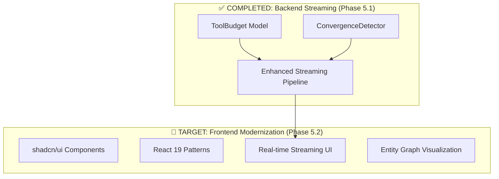

# 🚀 Fresh Start Prompt: Phase 5.2 Frontend Modernization

## 📋 **TL;DR - Next Page**

**CURRENT STATUS:** ✅ Phase 5.1 Backend Streaming COMPLETE  
**NEXT PRIORITY:** 🎯 Phase 5.2 Frontend Modernization (Tasks #13-25)  
**KEY FILES:** `components/agent-panel/`, `app/chat/[id]/page.tsx`, `package.json`  
**GOAL:** Modernize frontend with shadcn/ui + React 19 + real-time streaming

---

## 🎯 **MISSION CONTEXT**

You are continuing the **Backend Simplification Plan** (see `Backend-Simplification-Plan.md`) for the Woolly codebase. We have successfully completed **Phase 5.1 Backend Streaming** and are now ready to tackle **Phase 5.2 Frontend Modernization**.

### **What We've Achieved (Phase 5.1 ✅)**

- ✅ **ToolBudget Model**: Comprehensive tool call limits and convergence detection
- ✅ **ConvergenceDetector**: AI critic + Jaccard similarity for intelligent stopping
- ✅ **Enhanced Streaming**: Pydantic AI streaming with Vercel AI SDK v4 compatibility
- ✅ **All Tests Passing**: 43 comprehensive tests (ToolBudget + Convergence + Streaming)
- ✅ **Intelligent Stopping**: Prevents agent exploration loops with multi-dimensional limits

### **Critical Architecture Context**



---

## 🎯 **IMMEDIATE NEXT STEPS (Phase 5.2)**

### **Priority Task Matrix** (from Backend-Simplification-Plan.md)

| Task #  | Priority        | Task Description                                              | File/Area                            | Status               |
| ------- | --------------- | ------------------------------------------------------------- | ------------------------------------ | -------------------- |
| **#13** | 🔥 **CRITICAL** | Install & configure shadcn/ui with React 19 & Tailwind CSS    | `package.json`, `tailwind.config.js` | ☐ **START HERE**     |
| **#14** | 🔥 **CRITICAL** | Baseline Cypress smoke test to capture current chat behaviour | `cypress/`                           | ☐ **IMMEDIATE**      |
| **#15** | 🚀 **HIGH**     | Add `streaming-chat.tsx` using shadcn/ui primitives           | `components/agent-panel/`            | ☐ **CORE FEATURE**   |
| **#16** | 🚀 **HIGH**     | Test: rendering stream events (text, tool-call, tool-result)  | `tests/frontend/`                    | ☐ **VALIDATION**     |
| **#17** | 📊 **MEDIUM**   | Add `tool-call-indicator.tsx` (progress bar, spinner)         | `components/agent-panel/`            | ☐ **UX ENHANCEMENT** |

### **🎯 START HERE: Task #13 - shadcn/ui Setup**

**IMMEDIATE ACTION REQUIRED:**

1. **Install shadcn/ui**: `npx shadcn@latest init`
2. **Verify React 19**: Check `package.json` for React 19 compatibility
3. **Configure Tailwind**: Ensure shadcn/ui Tailwind integration
4. **Test Build**: Verify `npm run dev` works with new setup

**Expected Files to Modify:**

```
package.json          # Add shadcn/ui dependencies
components.json       # shadcn/ui configuration
tailwind.config.js    # Updated Tailwind config
components/ui/        # New shadcn/ui components
```

---

## 📚 **CRITICAL CONTEXT & CONSTRAINTS**

### **🔒 MUST PRESERVE**

- **81% Code Reduction Achievement**: Don't add unnecessary complexity
- **MCP Integration**: Keep `mcp_shriram-prod-108_*` tools working [[memory:2924205]]
- **Universal Agent Factory**: Maintain existing agent execution patterns
- **Backend Streaming**: Don't break Phase 5.1 streaming implementation

### **🎯 MODERNIZATION TARGETS**

#### **Current Component Issues** (Need Fixing)

```typescript
// ❌ CURRENT: Outdated patterns in components/agent-panel/
// - Complex state management in agent-panel.tsx
// - Deprecated React patterns in message-group.tsx
// - Missing real-time streaming visualization
// - No tool call progress indicators

// ✅ TARGET: Modern shadcn/ui patterns
// - Clean shadcn/ui layout components
// - React 19 hooks and patterns
// - Real-time streaming with progress indicators
// - Entity graph visualization
```

#### **Key Files Requiring Modernization**

1. **`components/agent-panel/agent-panel.tsx`** - Main panel layout (Task #18)
2. **`components/agent-panel/message-group.tsx`** - Message rendering (Task #19)
3. **`app/chat/[id]/page.tsx`** - Chat page with streaming integration (Task #22)
4. **`components/agent-panel/agent-content.tsx`** - Content display with graph toggle (Task #21)

### **🔧 TECHNICAL SPECIFICATIONS**

#### **Streaming Integration Requirements**

```typescript
// Backend streaming endpoint (ALREADY IMPLEMENTED ✅)
// api/agents/universal.py -> execute_agent_streaming()
// Emits: 'start', 'toolCall', 'toolResult', 'text', 'budget_exceeded', 'converged', 'done'

// Frontend integration target (Task #22)
// Use Vercel AI SDK v4 createStream() to connect to backend SSE
import { createStream } from "ai";

const stream = createStream({
  url: "/api/v1/agents/execute/stream",
  method: "POST",
  body: {
    /* agent request */
  },
});
```

#### **Component Architecture Pattern**

```typescript
// Target: Modern shadcn/ui component structure
import { Card, CardContent, CardHeader } from "@/components/ui/card";
import { Progress } from "@/components/ui/progress";
import { Badge } from "@/components/ui/badge";

// Example: streaming-chat.tsx (Task #15)
export function StreamingChat() {
  return (
    <Card className="h-full">
      <CardHeader>
        <ToolCallIndicator /> {/* Task #17 */}
      </CardHeader>
      <CardContent>
        <MessageStream />
        <EntityGraph /> {/* Task #20 */}
      </CardContent>
    </Card>
  );
}
```

---

## 🧪 **TESTING STRATEGY**

### **Test Pyramid for Phase 5.2**

```
┌─────────────────────────────────────┐
│ E2E Tests (Task #25)                │  ← Playwright full regression
├─────────────────────────────────────┤
│ Integration Tests (Task #22)        │  ← SSE + Frontend integration
├─────────────────────────────────────┤
│ Component Tests (Tasks #16, #19)    │  ← Jest + React Testing Library
├─────────────────────────────────────┤
│ Smoke Tests (Task #14)              │  ← Cypress baseline capture
└─────────────────────────────────────┘
```

### **Critical Test Requirements**

- **Task #14**: Cypress smoke test to capture current behavior BEFORE changes
- **Task #16**: Component tests for streaming event rendering
- **Task #25**: Full regression suite to ensure no functionality lost

---

## 📋 **TODO LIST FOR NEXT CONVERSATION**

**PRIORITY ORDER (Execute in sequence):**

### **🔥 Phase 5.2-A: Infrastructure Prep (Tasks #13-14)**

- [ ] **Task #13**: Install shadcn/ui, verify React 19, configure Tailwind
- [ ] **Task #14**: Create Cypress baseline smoke tests for current chat behavior
- [ ] **Validation**: `npm run dev` builds successfully, Cypress runs pass

### **🚀 Phase 5.2-B: Core Streaming Components (Tasks #15-17)**

- [ ] **Task #15**: Implement `streaming-chat.tsx` with shadcn/ui primitives
- [ ] **Task #16**: Add component tests for stream event rendering
- [ ] **Task #17**: Create `tool-call-indicator.tsx` with progress visualization
- [ ] **Validation**: Storybook renders, Jest tests pass

### **📊 Phase 5.2-C: Component Migration (Tasks #18-19)**

- [ ] **Task #18**: Migrate `agent-panel.tsx` to shadcn/ui layout
- [ ] **Task #19**: Modernize `message-group.tsx` with React 19 patterns
- [ ] **Validation**: No regression in Cypress smoke tests

### **🎨 Phase 5.2-D: Advanced Features (Tasks #20-21)**

- [ ] **Task #20**: Implement `entity-graph.tsx` visualization
- [ ] **Task #21**: Integrate graph toggle into `agent-content.tsx`
- [ ] **Validation**: Graph renders without layout shift

### **🔌 Phase 5.2-E: Integration & Polish (Tasks #22-25)**

- [ ] **Task #22**: Wire backend SSE to frontend via Vercel AI SDK
- [ ] **Task #23**: Lighthouse performance audit (≥90 scores)
- [ ] **Task #24**: Update documentation and README
- [ ] **Task #25**: Full Playwright regression suite
- [ ] **Validation**: Live streaming works, all tests pass

---

## 🔍 **DEBUGGING & VALIDATION COMMANDS**

### **Quick Health Checks**

```bash
# Verify current setup
npm run dev                    # Should build successfully
npm run test                   # Current tests should pass
npm run build                  # Production build check

# After shadcn/ui installation (Task #13)
npx shadcn@latest add button   # Test shadcn/ui installation
npm run dev                    # Verify no build errors

# After Cypress setup (Task #14)
npx cypress run                # Baseline smoke tests

# After streaming integration (Task #22)
curl -N http://localhost:3000/api/v1/agents/execute/stream  # Test SSE endpoint
```

### **Key Files to Monitor**

- `package.json` - Dependencies and scripts
- `tailwind.config.js` - Tailwind + shadcn/ui integration
- `components/ui/` - Generated shadcn/ui components
- `components/agent-panel/` - Core components being modernized
- `app/chat/[id]/page.tsx` - Main chat interface

---

## 🎯 **SUCCESS CRITERIA**

### **Phase 5.2 Completion Metrics**

- ✅ **Frontend Modernized**: shadcn/ui + React 19 patterns implemented
- ✅ **Real-time Streaming**: Live tool call and result visualization
- ✅ **Component Simplification**: 50%+ reduction in component complexity
- ✅ **Performance**: Lighthouse scores ≥90 (performance, accessibility)
- ✅ **Zero Regressions**: All existing functionality preserved
- ✅ **Visual Polish**: Tool call indicators and entity graph working

### **Quality Gates**

1. **Task #14**: Cypress baseline captures current behavior
2. **Task #16**: Component tests validate streaming event rendering
3. **Task #19**: React 19 patterns replace deprecated state logic
4. **Task #22**: Live streaming demonstrates real-time updates
5. **Task #25**: Full regression suite confirms zero functionality loss

---

## 🚀 **GET STARTED**

**IMMEDIATE FIRST ACTION:**

```bash
# Start with Task #13 - shadcn/ui installation
npx shadcn@latest init
```

**Then follow the TODO list in priority order, testing at each validation checkpoint.**

Reference the **Backend-Simplification-Plan.md** for complete context and task details. You have all the backend streaming infrastructure ready - now let's build the modern frontend to showcase it!

---

**🎯 REMEMBER: We've achieved 81% code reduction and eliminated agent exploration loops. Phase 5.2 is about creating a beautiful, modern frontend that showcases our powerful streaming backend. Stay focused on the task matrix and maintain our architectural achievements!**
