# 🚀 Fresh Start: Backend Simplification - Phase 1 Implementation

## 📋 **TLDR - Next Page Summary**

**CURRENT MISSION**: Implement **Phase 1: Universal Foundation** of the Backend Simplification Plan
**PRIORITY**: ⚡ **HIGHEST** - This is the foundation for 83% code reduction
**ESTIMATED TIME**: 45-60 minutes
**COMPLEXITY**: Medium (creating new architecture patterns)

## 🎯 **Context & Current State**

### **What We're Building**

We're implementing a **Universal Parallel Agent Architecture** that will:

- Replace 5+ specialized agent factories with 1 universal factory
- Achieve **90% code reduction** in agent management
- Enable true parallel execution of multiple agent types
- Follow Pydantic AI best practices with full DRY compliance

### **Current Architecture Problems**

```
❌ CURRENT: Complex, Non-DRY System
├── api/agents/core.py (597 lines) - DocumentationAgentFactory only
├── api/agents/examples.py (342 lines) - Specialized examples
└── Multiple specialized dependencies and models

🎯 TARGET: Universal, DRY System
├── api/agents/universal.py (NEW) - Single universal factory
├── api/agents/parallel.py (NEW) - Parallel execution manager
└── 90% code reduction achieved
```

### **The 4 New Agent Types We're Adding**

1. **Simplifier**: Code analysis, DRY suggestions, refactoring recommendations
2. **Tester**: Test generation, execution, coverage analysis
3. **ConvoStarter**: Conversation flow analysis, next steps guidance
4. **Summarizer**: Context distillation, actionable item extraction

## 📁 **Phase 1: Files to Create/Modify**

### 🆕 **NEW FILES TO CREATE**

#### **1. `api/agents/universal.py` (PRIMARY FOCUS)**

**Purpose**: Single universal agent factory replacing all specialized factories
**Key Components**:

```python
# Core Classes to Implement:
class AgentType(str, Enum):
    SIMPLIFIER = "simplifier"
    TESTER = "tester"
    CONVO_STARTER = "convo_starter"
    SUMMARIZER = "summarizer"
    DOCUMENTATION = "documentation"  # Keep existing

class UniversalDependencies(BaseModel):
    """Single dependency model for ALL agent types"""
    repository_name: str
    agent_type: AgentType
    user_query: str
    context: Dict[str, Any] = Field(default_factory=dict)
    # Optional fields for different agent types...

class UniversalResult(BaseModel):
    """Single result model for ALL agent types"""
    agent_type: AgentType
    content: str
    metadata: Dict[str, Any] = Field(default_factory=dict)
    # Dynamic fields populated based on agent type...

class UniversalAgentFactory:
    """Single factory for ALL agent types - 90% code reduction"""
    # Implementation with dynamic prompts and MCP integration
```

#### **2. `api/agents/parallel.py` (PHASE 2 PREP)**

**Purpose**: Parallel execution manager for running multiple agents concurrently
**Status**: Create basic structure in Phase 1, full implementation in Phase 2

### 🔧 **FILES TO MODIFY**

#### **3. `api/agents/__init__.py`**

**Purpose**: Update exports to include new universal system
**Changes**: Add exports for `UniversalAgentFactory`, `AgentType`, etc.

## 🏗️ **Implementation Architecture**

### **Universal Agent Specialization Pattern**

```mermaid
graph TB
    subgraph "🎯 Universal Agent Factory"
        FACTORY[UniversalAgentFactory]
        PROMPTS[Dynamic Prompt System]
        MCP[MCP Integration]
    end

    subgraph "🤖 Agent Types"
        SIMP[Simplifier Agent]
        TEST[Tester Agent]
        CONV[ConvoStarter Agent]
        SUMM[Summarizer Agent]
        DOC[Documentation Agent]
    end

    subgraph "📊 Universal Models"
        DEPS[UniversalDependencies]
        RESULT[UniversalResult]
    end

    FACTORY --> PROMPTS
    FACTORY --> MCP
    PROMPTS --> SIMP
    PROMPTS --> TEST
    PROMPTS --> CONV
    PROMPTS --> SUMM
    PROMPTS --> DOC

    FACTORY --> DEPS
    FACTORY --> RESULT
```



### **Key Design Principles**

1. **Single Responsibility**: One factory handles all agent types via dynamic prompts
2. **DRY Compliance**: Zero code duplication across agent types
3. **Type Safety**: Full Pydantic validation throughout
4. **MCP Integration**: Consistent MCP server connectivity for all agents
5. **Extensibility**: Add new agent types by just adding prompt definitions

## 📝 **Detailed Implementation Specifications**

### **UniversalAgentFactory.specializations Dictionary**

```python
self.specializations = {
    AgentType.SIMPLIFIER: """
You are a code simplification expert focused on DRY principles and clean architecture.

Your mission:
1. Analyze codebase structure and identify code smells
2. Suggest refactoring for better organization and testability
3. Create markdown tables of recommended changes
4. Prioritize changes by impact and effort

Use MCP tools extensively to understand code patterns and dependencies.
""",

    AgentType.TESTER: """
You are a comprehensive testing expert who creates and executes tests.

Your mission:
1. Identify missing test coverage areas
2. Generate appropriate test files (unit, integration, e2e)
3. Execute tests using terminal commands
4. Provide detailed coverage analysis and recommendations

Use MCP tools to understand code structure and create comprehensive tests.
""",

    AgentType.CONVO_STARTER: """
You are a conversation flow expert who analyzes context and guides next steps.

Your mission:
1. Analyze current conversation progress and context
2. Identify logical next actions and priorities
3. Suggest conversation directions based on goals
4. Provide context-aware recommendations

Use conversation history and current state to make intelligent recommendations.
""",

    AgentType.SUMMARIZER: """
You are a context summarization expert who distills information effectively.

Your mission:
1. Create concise summaries preserving key information
2. Extract actionable items and important decisions
3. Identify critical context to maintain
4. Condense complex information while preserving meaning

Focus on clarity and completeness in minimal space.
""",

    AgentType.DOCUMENTATION: """
You are a comprehensive documentation expert with deep codebase knowledge.

Your mission:
1. Generate thorough technical documentation
2. Create architecture overviews and component analysis
3. Document APIs, workflows, and best practices
4. Provide clear, actionable documentation for developers

Use MCP tools to create comprehensive, accurate documentation.
"""
}
```

### **MCP Integration Pattern**

```python
def __init__(self):
    self.mcp_server = MCPServerSSE(url="http://localhost:8009/sse")
    # Consistent MCP integration across all agent types

def create_agent(self, agent_type: AgentType) -> Agent:
    """Create any agent type with single method"""
    system_prompt = f"""
You are an expert AI assistant with access to powerful MCP tools.

AGENT TYPE: {agent_type.value.replace('_', ' ').title()}

{self.specializations[agent_type]}

Available MCP Tools:
- mcp_search_code: Search for code patterns and implementations
- mcp_find_entities: Discover functions, classes, files
- mcp_get_entity_relationships: Map dependencies and relationships
- mcp_qa_codebase: Get comprehensive codebase insights
"""

    return Agent(
        model="openai:gpt-4o-mini",
        deps_type=UniversalDependencies,
        result_type=UniversalResult,
        system_prompt=system_prompt,
        mcp_servers=[self.mcp_server]
    )
```

## ✅ **Phase 1 Success Criteria**

### **Immediate Deliverables**

- [ ] `api/agents/universal.py` created with full implementation
- [ ] `api/agents/parallel.py` created with basic structure
- [ ] `api/agents/__init__.py` updated with new exports
- [ ] All 5 agent types (Simplifier, Tester, ConvoStarter, Summarizer, Documentation) working
- [ ] MCP integration functional for all agent types
- [ ] Type safety validated with Pydantic models

### **Validation Tests**

```python
# Test each agent type creation
for agent_type in AgentType:
    agent = universal_factory.create_agent(agent_type)
    assert isinstance(agent, Agent)
    assert agent.deps_type == UniversalDependencies
    assert agent.result_type == UniversalResult
```

### **Code Reduction Metrics**

- **Before**: `api/agents/core.py` (597 lines) + multiple specialized factories
- **After**: `api/agents/universal.py` (~150 lines) for ALL agent types
- **Reduction**: **90% code reduction achieved**

## 🎯 **TODO List for Implementation**

### **HIGH PRIORITY TODOS**

1. **Create Universal Agent Factory**

   - [ ] Create `api/agents/universal.py` file
   - [ ] Implement `AgentType` enum with all 5 agent types
   - [ ] Implement `UniversalDependencies` model with all required fields
   - [ ] Implement `UniversalResult` model with dynamic fields
   - [ ] Implement `UniversalAgentFactory` class with specializations dictionary
   - [ ] Add MCP integration following existing patterns from `core.py`
   - [ ] Implement `create_agent()` method with dynamic prompt generation

2. **Create Parallel System Foundation**

   - [ ] Create `api/agents/parallel.py` file
   - [ ] Implement basic `ParallelAgentManager` class structure
   - [ ] Add placeholder methods for Phase 2 implementation
   - [ ] Import and reference `universal_factory`

3. **Update Module Exports**
   - [ ] Update `api/agents/__init__.py` to export new classes
   - [ ] Add imports for `UniversalAgentFactory`, `AgentType`, `UniversalDependencies`, `UniversalResult`
   - [ ] Maintain backward compatibility with existing exports

### **VALIDATION TODOS**

4. **Test Agent Creation**

   - [ ] Test each agent type creation: Simplifier, Tester, ConvoStarter, Summarizer, Documentation
   - [ ] Verify MCP server connectivity for all agent types
   - [ ] Validate Pydantic model serialization/deserialization
   - [ ] Test dynamic prompt generation for each specialization

5. **Integration Testing**
   - [ ] Test with existing MCP tools (`mcp_search_code`, `mcp_find_entities`, etc.)
   - [ ] Verify compatibility with current router endpoints
   - [ ] Test error handling and edge cases
   - [ ] Validate memory usage and performance

### **DOCUMENTATION TODOS**

6. **Update Documentation**
   - [ ] Update `api/agents/README.md` with universal factory usage
   - [ ] Document new agent types and their purposes
   - [ ] Add examples for each agent type
   - [ ] Document migration path from old to new system

## 🔄 **Next Phase Preview**

### **Phase 2: Parallel Execution System**

**After Phase 1 completion**, the next conversation should focus on:

- Implementing full `ParallelAgentManager` with asyncio task coordination
- Adding background task support and progress tracking
- Creating universal API endpoints in `api/routers/universal_agents.py`
- Testing parallel execution of multiple agents simultaneously

### **Expected Phase 2 Outcomes**

- True parallel agent execution (run Simplifier + Tester + ConvoStarter simultaneously)
- Background task management with progress tracking
- 83% reduction in orchestration complexity
- Real-time status updates for running agents

## 🚨 **Critical Implementation Notes**

### **Maintain Backward Compatibility**

- Keep existing `DocumentationAgentFactory` functional during transition
- Ensure existing API endpoints continue working
- Preserve database schemas and models

### **Follow Pydantic AI Best Practices**

- Use proper `async with agent.run_mcp_servers():` context management
- Implement proper error handling and validation
- Follow the orchestrator-workers pattern for parallel execution

### **MCP Integration Requirements**

- Use consistent MCP server URL: `http://localhost:8009/sse`
- Ensure all agents have access to the same MCP tools
- Validate MCP connectivity before agent execution

## 🎯 **Success Metrics**

### **Phase 1 Completion Indicators**

1. **Code Reduction**: 90% reduction in agent factory code achieved
2. **Functionality**: All 5 agent types working with MCP integration
3. **Type Safety**: Full Pydantic validation throughout
4. **DRY Compliance**: Zero code duplication across agent types
5. **Extensibility**: Easy to add new agent types with just prompt definitions

### **Ready for Phase 2 When**

- [ ] Universal factory creates all agent types successfully
- [ ] MCP integration working for all agent types
- [ ] Parallel manager basic structure in place
- [ ] All validation tests passing
- [ ] Documentation updated

---

**🚀 START HERE**: Begin with creating `api/agents/universal.py` and implementing the `UniversalAgentFactory` class. This single file will replace the entire complex agent system and achieve 90% code reduction while adding 4 new agent types.

**📚 REFERENCE**: Use `@Backend-Simplification-Plan.md` for complete technical specifications and architectural details.
