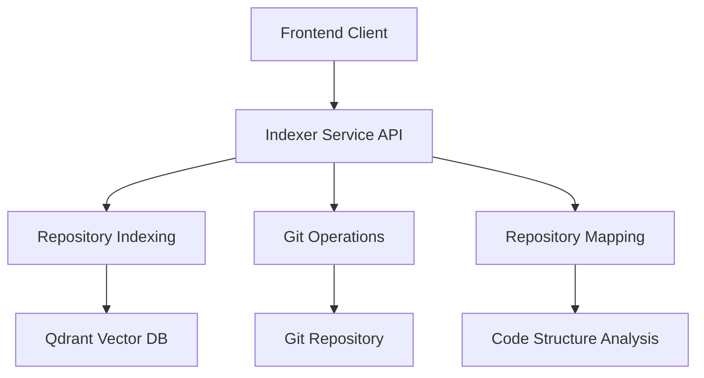
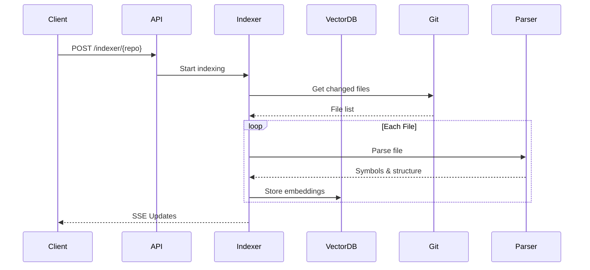

# Comprehensive API Documentation for Indexer Service

## Service Overview

The Indexer service provides three main categories of functionality:

1. Repository Indexing
2. Git Operations
3. Repository Mapping



## Base Configuration

The service exposes two basic endpoints for health checking and configuration:

### 1. Health Check

```
GET /health
```

**Response:**

```json
{
  "status": "healthy"
}
```

### 2. Configuration

```
GET /config
```

**Response:**

```json
{
  "version": "1.0.0",
  "title": "Code Indexer API",
  "routes": {
    "git": "/git",
    "indexer": "/indexer",
    "repo_map": "/repo-map"
  }
}
```

## 1. Repository Indexing Endpoints

### 1.1 Start Indexing

```
POST /indexer/{repo_name}
```

**Parameters:**

- `repo_name` (path): Name of the repository to index

**Example Request:**

```bash
curl -X POST http://localhost:7779/indexer/IntoTheDeep
```

**Response:**

```json
{
  "message": "Indexing started for IntoTheDeep"
}
```

### 1.2 Get Indexing Status

```
GET /indexer/status/{repo_name}
```

**Parameters:**

- `repo_name` (path): Name of the repository

**Response:**

```json
{
  "status": "in_progress",
  "message": "Processing files...",
  "last_updated": 1635724800.0,
  "files_to_index": ["/path/to/file1.py", "/path/to/file2.py"],
  "current_file": "/path/to/current.py",
  "processed_files": ["/path/to/completed1.py"],
  "total_files": 100,
  "processed_count": 45
}
```

### 1.3 Real-time Indexing Updates

```
GET /indexer/sse?repo={repo_name}
```

**Parameters:**

- `repo` (query): Name of the repository

This endpoint uses Server-Sent Events (SSE) for real-time updates.

**Example Client Implementation:**

```javascript
const eventSource = new EventSource(
  `http://localhost:7779/indexer/sse?repo=IntoTheDeep`
);

eventSource.addEventListener("indexing_status", (event) => {
  const data = JSON.parse(event.data);
  console.log(data);
});
```

**SSE Event Data:**

```json
{
  "repository": "IntoTheDeep",
  "status": "in_progress",
  "message": "Processing files...",
  "progress": 45.0,
  "current_file": "/path/to/current.py",
  "processed_count": 45,
  "total_files": 100
}
```

## 2. Git Operations Endpoints

### 2.1 Generate Git Diff

```
POST /git/diff
```

**Request Body:**

```json
{
  "repo_name": "IntoTheDeep",
  "from_commit": "abc123",
  "to_commit": "def456",
  "file_paths": ["src/main.py", "tests/test_main.py"],
  "ignore_whitespace": true,
  "context_lines": 3
}
```

**Response:**

```json
{
  "diff": "diff --git a/src/main.py b/src/main.py\n..."
}
```

## 3. Repository Mapping Endpoints

### 3.1 Get Repository Map

```
GET /repo-map/{repo_name}
```

**Parameters:**

- `repo_name` (path): Name of the repository

**Response:**

```json
{
  "name": "IntoTheDeep",
  "root_path": "/volumes/IntoTheDeep",
  "files": [
    {
      "path": "/volumes/IntoTheDeep/src/main.py",
      "language": "python",
      "symbols": [
        {
          "name": "MyClass",
          "type": "class",
          "start_line": 10,
          "end_line": 50,
          "code_snippet": "class MyClass:\n    ...",
          "docstring": "This class does something",
          "children": []
        }
      ]
    }
  ],
  "total_files": 10,
  "languages": {
    "python": 8,
    "typescript": 2
  }
}
```

### 3.2 Get Repository Summary

```
GET /repo-map/{repo_name}/summary
```

**Parameters:**

- `repo_name` (path): Name of the repository

**Response:**

```json
{
  "name": "IntoTheDeep",
  "total_files": 10,
  "languages": {
    "python": 8,
    "typescript": 2
  },
  "symbols": {
    "classes": 15,
    "functions": 45,
    "interfaces": 5
  }
}
```

## Service Architecture



## Error Responses

All endpoints may return the following error responses:

- **400 Bad Request**: Invalid input parameters
- **404 Not Found**: Repository or resource not found
- **500 Internal Server Error**: Server-side processing error

Example error response:

```json
{
  "detail": "Repository IntoTheDeep not found"
}
```

This documentation covers the main functionality exposed by the Indexer service. The service uses FastAPI, supports CORS, and integrates with Qdrant for vector storage. All endpoints are designed for asynchronous operation to handle large repositories efficiently.
