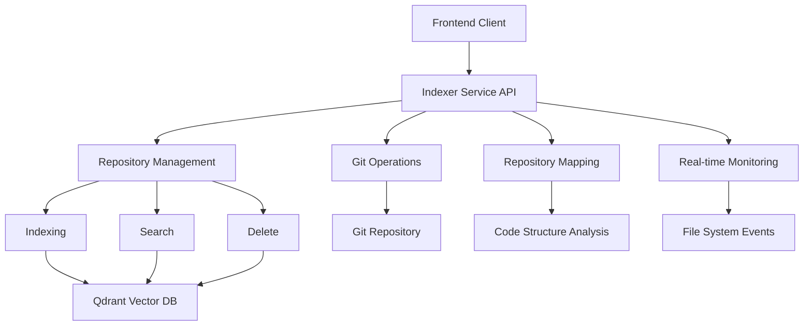
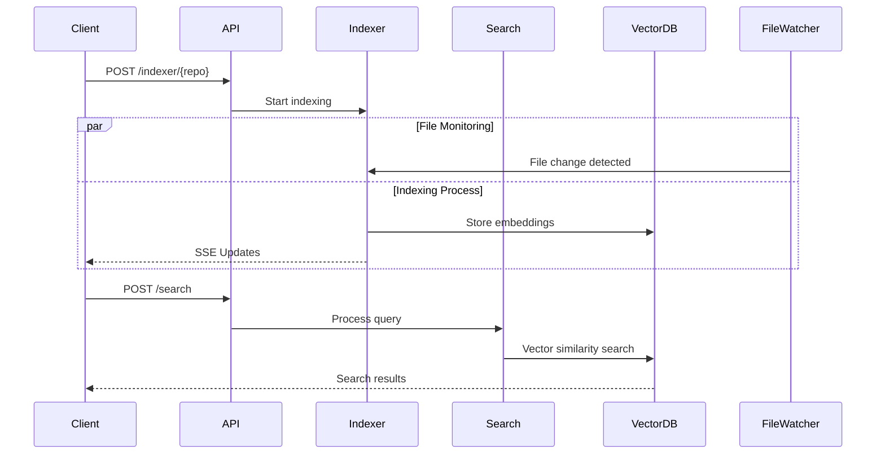
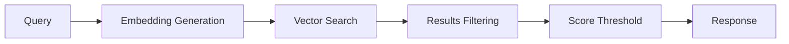

# Comprehensive API Documentation for Indexer Service

## Service Overview

The Indexer service provides a comprehensive solution for code repository management with four main categories of functionality:

1. Repository Indexing & Search
2. Git Operations
3. Repository Mapping
4. Real-time Change Detection



## Base Configuration

### 1. Health Check

```http
GET /health
```

**Response:**

```json
{
  "status": "healthy"
}
```

### 2. Configuration

```http
GET /config
```

**Response:**

```json
{
  "version": "1.0.0",
  "title": "Code Indexer API",
  "routes": {
    "git": "/git",
    "indexer": "/indexer",
    "repo_map": "/repo-map"
  }
}
```

## 1. Repository Management Endpoints

### 1.1 Start Indexing

```http
POST /indexer/{repo_name}
```

**Example Request:**

```bash
curl -X POST http://localhost:7779/indexer/IntoTheDeep
```

### 1.2 Search Repository

```http
POST /indexer/{repo_name}/search
```

**Request Body:**

```json
{
  "query": "function that handles authentication",
  "limit": 10,
  "threshold": 0.7,
  "file_paths": ["src/auth/", "src/services/auth.ts"],
  "chunk_types": ["function", "class"]
}
```

**Response:**

```json
{
  "results": [
    {
      "content": "async function authenticateUser(credentials) {...}",
      "chunk_type": "function",
      "file_path": "src/auth/authentication.ts",
      "start_line": 10,
      "end_line": 25,
      "score": 0.89,
      "repository": "IntoTheDeep"
    }
  ],
  "total_found": 1,
  "query_time_ms": 45.2
}
```

### 1.3 Delete Repository Index

```http
DELETE /indexer/{repo_name}
```

**Response:**

```json
{
  "message": "Index deleted for IntoTheDeep"
}
```

### 1.4 Get Repository Statistics

```http
GET /indexer/{repo_name}/stats
```

**Response:**

```json
{
  "repository": "IntoTheDeep",
  "total_points": 1250,
  "collection": "code_chunks"
}
```

### 1.5 Get All Repositories

```http
GET /indexer/repositories
```

**Response:**

```json
{
  "repositories": [
    {
      "name": "IntoTheDeep",
      "path": "/volumes/IntoTheDeep",
      "language": "python",
      "indexing_status": "completed",
      "last_indexed": "abc123def456",
      "index_stats": {
        "total_chunks": 1250,
        "collection": "code_chunks",
        "has_index": true
      }
    }
  ],
  "total_count": 1,
  "indexed_count": 1
}
```

### 1.6 Real-time Indexing Status (SSE)

```http
GET /indexer/sse?repo={repo_name}
```

**Example Client Implementation:**

```javascript
const eventSource = new EventSource(
  `http://localhost:7779/indexer/sse?repo=IntoTheDeep`
);

eventSource.addEventListener("indexing_status", (event) => {
  const data = JSON.parse(event.data);
  console.log(data);
});
```

## 2. Git Operations

### 2.1 Generate Git Diff

```http
POST /git/diff
```

**Request Body:**

```json
{
  "repo_name": "IntoTheDeep",
  "from_commit": "abc123",
  "to_commit": "def456",
  "file_paths": ["src/main.py"],
  "ignore_whitespace": true,
  "context_lines": 3
}
```

## 3. Repository Mapping

### 3.1 Get Repository Map

```http
GET /repo-map/{repo_name}
```

### 3.2 Get Repository Summary

```http
GET /repo-map/{repo_name}/summary
```

## Service Architecture

### Core Components Flow



### Search Flow



## Error Handling

All endpoints follow a consistent error response format:

```json
{
  "detail": "Error message description"
}
```

Common HTTP Status Codes:

- 400: Bad Request (invalid parameters)
- 404: Not Found (repository/resource not found)
- 500: Internal Server Error

## Real-time Monitoring

The service includes automatic file system monitoring with:

- Git-aware change detection
- Configurable cooldown periods
- Intelligent reindexing triggers
- Ignore patterns support

No additional configuration is needed as this functionality is built into the service.
