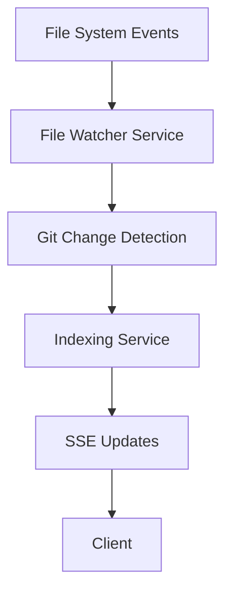

# Step 5: Updating Documentation with New Features

## My Understanding of the Problem

We need to document all the new features and endpoints we've added, following the same format as the existing documentation. The key additions include:

1. File-level statistics during indexing
2. File watching functionality
3. Repository auto-population endpoint

## Artefacts

```markdown:Indexer-Documentation-Updates.md
# Updates to Indexer Service Documentation

## New Features Overview

1. Granular File Processing Statistics
2. Real-time File Change Detection
3. Enhanced Repository Information

### 1. Enhanced Indexing Status

The indexing status endpoints now provide detailed file-level statistics:

#### 1.2 Get Indexing Status (Updated)

```

GET /indexer/status/{repo_name}

````

**Response:**
```json
{
  "status": "in_progress",
  "message": "Processing files...",
  "last_updated": 1635724800.0,
  "files_to_index": ["/path/to/file1.py", "/path/to/file2.py"],
  "current_file": "/path/to/current.py",
  "processed_files": ["/path/to/completed1.py"],
  "total_files": 100,
  "processed_count": 45,
  "file_stats": {
    "current": {
      "total_lines": 150,
      "processed_lines": 75,
      "total_tokens": 1000,
      "processed_tokens": 500,
      "total_bytes": 5000,
      "processed_bytes": 2500,
      "status": "processing"
    },
    "processed": [
      {
        "path": "/path/to/completed1.py",
        "stats": {
          "total_lines": 200,
          "processed_lines": 200,
          "total_tokens": 1500,
          "processed_tokens": 1500,
          "total_bytes": 7500,
          "processed_bytes": 7500,
          "status": "completed"
        }
      }
    ]
  }
}
````

#### 1.3 Real-time Indexing Updates (Enhanced SSE)

The SSE endpoint now includes detailed file processing statistics:

```
GET /indexer/sse?repo={repo_name}
```

**SSE Event Data:**

```json
{
  "repository": "IntoTheDeep",
  "status": "in_progress",
  "message": "Processing files...",
  "progress": 45.0,
  "current_file": "/path/to/current.py",
  "processed_count": 45,
  "total_files": 100,
  "file_stats": {
    "current": {
      "total_lines": 150,
      "processed_lines": 75,
      "total_tokens": 1000,
      "processed_tokens": 500,
      "total_bytes": 5000,
      "processed_bytes": 2500,
      "status": "processing"
    },
    "processed": [
      {
        "path": "/path/to/file.py",
        "stats": {
          "total_lines": 200,
          "processed_lines": 200,
          "total_tokens": 1500,
          "processed_tokens": 1500,
          "total_bytes": 7500,
          "processed_bytes": 7500,
          "status": "completed"
        }
      }
    ]
  }
}
```

### 2. File Change Detection

The service now automatically monitors repository directories for changes and triggers reindexing when necessary. This functionality is built into the service and requires no additional API calls.

Features:

- Real-time file system monitoring
- Automatic reindexing on detected changes
- Intelligent cooldown period to prevent rapid re-indexing
- Git-aware change detection
- Configurable ignore patterns

### 3. Repository Information

#### 3.1 Get All Repositories

```
GET /indexer/repositories
```

**Response:**

```json
{
  "repositories": [
    {
      "name": "IntoTheDeep",
      "path": "/volumes/IntoTheDeep",
      "language": "python",
      "indexing_status": "completed",
      "last_indexed": "abc123def456"
    }
  ],
  "total_count": 1
}
```

## Service Architecture Updates

The following components have been added to the service architecture:



## Error Handling

All new endpoints follow the same error response format as existing endpoints:

```json
{
  "detail": "Error message description"
}
```

Common error scenarios:

- File access permission denied
- Invalid repository configuration
- Git repository access issues
- File system monitoring failures

```

```
