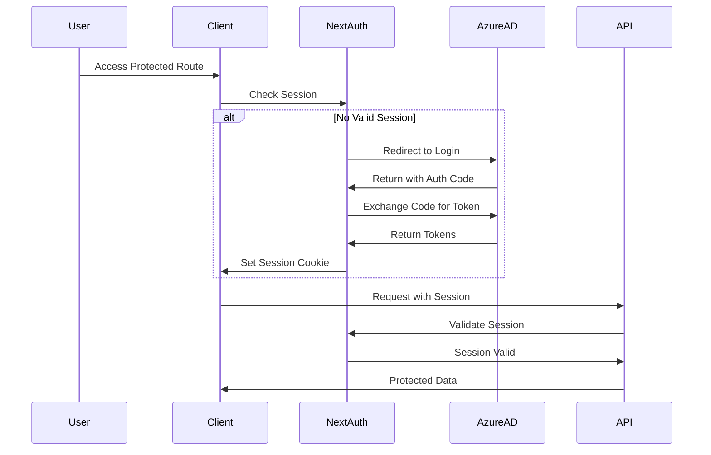
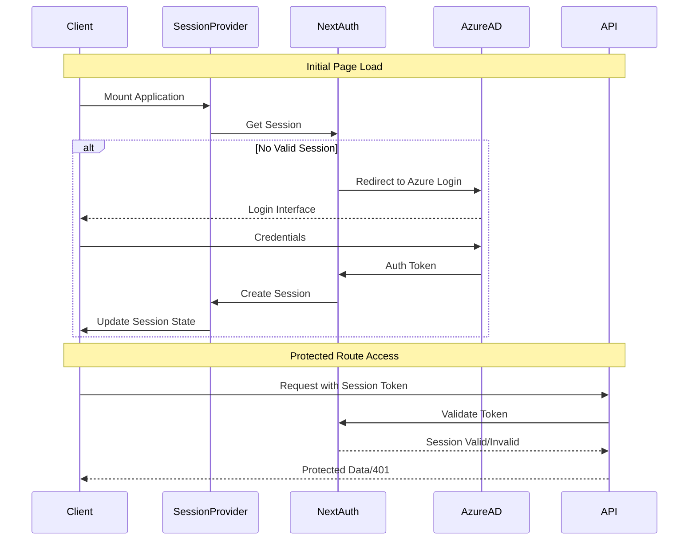
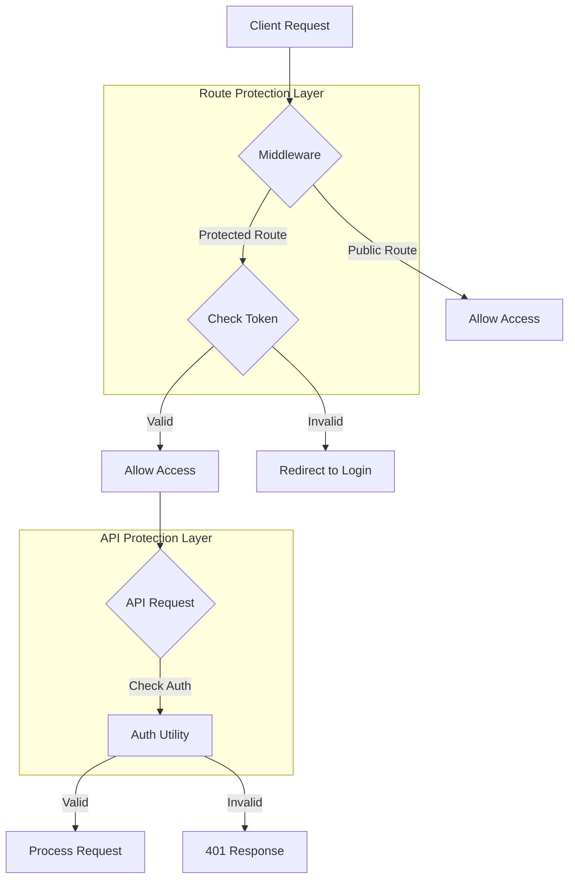
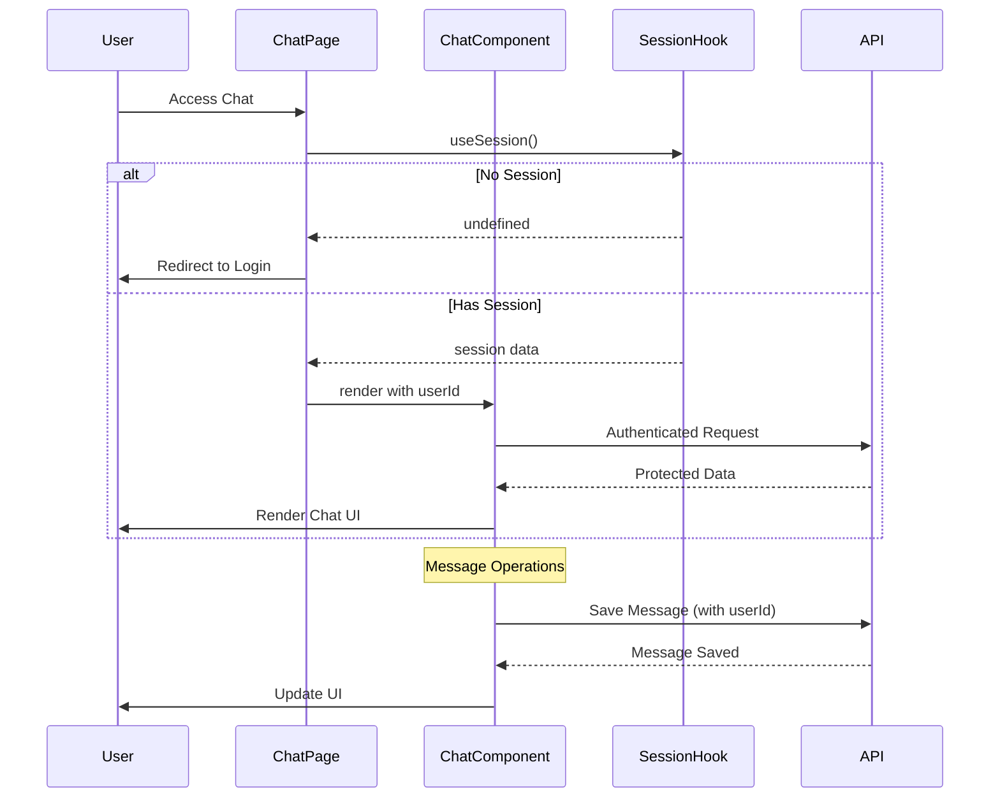
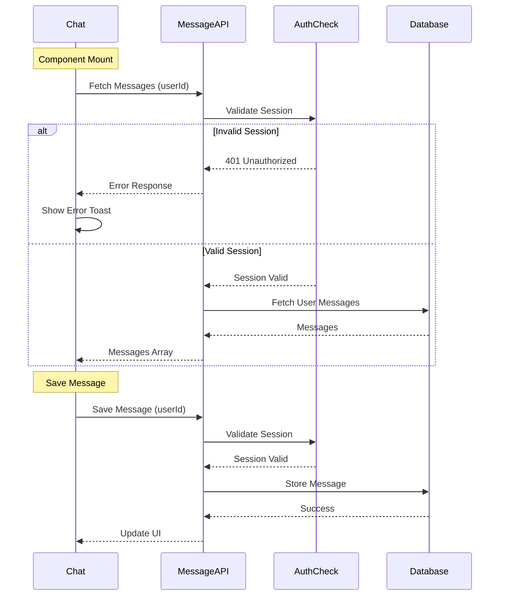

### Authentication Implementation - Complete Overview

Break down of key features added:

- Core Authentication Flow
	- NextAuth Configuration
	- Session Management
	- Azure AD Integration
- Route Protection System
	- Middleware Implementation
	- API Route Protection
	- Server-Side Auth Checks
- Client-Side Authentication
	- Session Provider
	- Protected Components
	- User Context Integration
- Chat Integration with Auth
	- Message Authentication
	- User-Specific Data Handling
	- Protected API Calls

# Feature 1: Core Authentication Flow

## File Structure
```markdown
📁 app/
├── api/
│   └── auth/
│       └── [...nextauth]/
│           └── route.ts       # NextAuth configuration
├── layout.tsx                 # Root layout with SessionProvider
└── components/
    └── session-provider.tsx   # Client-side session wrapper
```

## Authentication Flow Diagram



## Key Implementation Details

1. **NextAuth Configuration**
```typescript:app/api/auth/[...nextauth]/route.ts
export const authOptions: AuthOptions = {
  providers: [
    AzureADProvider({
      clientId: process.env.AZURE_AD_CLIENT_ID!,
      clientSecret: process.env.AZURE_AD_CLIENT_SECRET!,
      tenantId: process.env.AZURE_AD_TENANT_ID,
    }),
  ],
  callbacks: {
    async jwt({ token, user, account }) {
      if (account && user) {
        return {
          ...token,
          accessToken: account.access_token,
          refreshToken: account.refresh_token,
          userId: user.id,
        };
      }
      return token;
    },
    async session({ session, token }) {
      session.accessToken = token.accessToken;
      session.userId = token.userId;
      return session;
    },
  },
  pages: {
    signIn: '/auth/signin',
  },
};
```

2. **Session Provider Setup**
```typescript:components/session-provider.tsx
'use client';
export function SessionProvider({ children }: { children: React.ReactNode }) {
  return <NextAuthSessionProvider>{children}</NextAuthSessionProvider>;
}
```

## Integration Points
1. **Environment Variables Required**
```env
NEXTAUTH_URL=http://localhost:3000
NEXTAUTH_SECRET=your-secret-key
AZURE_AD_CLIENT_ID=your-client-id
AZURE_AD_CLIENT_SECRET=your-client-secret
AZURE_AD_TENANT_ID=your-tenant-id
```

2. **Type Extensions**
```typescript:types/next-auth.d.ts
declare module "next-auth" {
  interface Session {
    accessToken?: string;
    userId?: string;
  }
  interface JWT {
    accessToken?: string;
    refreshToken?: string;
    userId?: string;
  }
}
```


# Feature 1: Core Authentication Flow - Revised with PR Diff

## File Structure and Changes
```markdown
📁 app/
├── api/
│   └── auth/
│       └── [...nextauth]/
│           └── route.ts       # NextAuth configuration with Azure AD
├── layout.tsx                # Added SessionProvider + Inter font
└── components/
    └── session-provider.tsx  # New client-side session wrapper
```

## Package Changes
```diff
+ "@auth/core": "^0.37.4"
+ "@auth/nextjs": "0.0.0-380f8d56"
+ "next-auth": "^4.24.11"
```

## Authentication Flow Diagram



## Key Implementation Details

1. **Session Provider Integration**
```typescript:app/layout.tsx
import { Inter } from "next/font/google";
import { SessionProvider } from "@/components/session-provider";

const inter = Inter({ subsets: ["latin"] });

export default function RootLayout({
  children,
}: {
  children: React.ReactNode;
}) {
  return (
    <html lang="en">
      <body className={inter.className}>
        <SessionProvider>
          {children}
        </SessionProvider>
      </body>
    </html>
  );
}
```

2. **Client Session Provider**
```typescript:components/session-provider.tsx
'use client';
import { SessionProvider as NextAuthSessionProvider } from 'next-auth/react';

export function SessionProvider({ children }: { children: React.ReactNode }) {
  return <NextAuthSessionProvider>{children}</NextAuthSessionProvider>;
}
```

## Integration Points

1. **Required Environment Setup**
```env
NEXTAUTH_URL=http://localhost:3000
NEXTAUTH_SECRET=your-secret-key
AZURE_AD_CLIENT_ID=your-client-id
AZURE_AD_CLIENT_SECRET=your-client-secret
AZURE_AD_TENANT_ID=your-tenant-id
```

2. **Dependencies to Install**
```bash
npm install @auth/core@0.37.4 @auth/nextjs@0.0.0-380f8d56 next-auth@4.24.11
```

# Feature 2: Route Protection System

## File Structure
```markdown
📁 root/
├── middleware.ts            # Global route protection
├── lib/
│   └── auth.ts             # Auth utility functions
└── app/
    └── api/
        └── chat/
            ├── [chatId]/
            │   ├── route.ts           # Protected chat endpoints
            │   └── messages/
            │       └── route.ts       # Protected message endpoints
```

## Protection Flow Diagram



## Key Implementation Details

1. **Global Middleware**
```typescript:middleware.ts
export function middleware(request: NextRequest) {
  const path = request.nextUrl.pathname
  const isPublicPath = path === '/auth/signin' || 
                      path === '/auth/signup' || 
                      path === '/auth/verify'

  const token = request.cookies.get('next-auth.session-token')?.value || ''

  if (!token && !isPublicPath) {
    return NextResponse.redirect(new URL('/auth/signin', request.url))
  }

  if (token && isPublicPath) {
    return NextResponse.redirect(new URL('/', request.url))
  }

  return NextResponse.next()
}

export const config = {
  matcher: ['/((?!api|_next/static|_next/image|favicon.ico).*)'],
}
```

2. **Auth Utility**
```typescript:lib/auth.ts
import { getServerSession } from "next-auth/next";
import { NextResponse } from "next/server";
import { authOptions } from "@/app/api/auth/[...nextauth]/route";

export async function checkAuth() {
  const session = await getServerSession(authOptions);
  
  if (!session) {
    return new NextResponse("Unauthorized", { status: 401 });
  }
  
  return session;
}
```

3. **Protected API Route Example**
```typescript:app/api/chat/[chatId]/route.ts
export async function GET(
  req: NextRequest,
  { params }: { params: { chatId: string } }
) {
  const session = await checkAuth();
  if (session instanceof NextResponse) return session;

  try {
    // Your existing GET logic here with session.user.id
    return NextResponse.json({ /* your response */ });
  } catch (error) {
    return new NextResponse("Internal Server Error", { status: 500 });
  }
}
```

## Integration Points

1. **Protected Routes**
- All routes except public paths require authentication
- API routes use `checkAuth` utility
- Session validation at multiple levels

2. **Error Handling**
- Proper status codes (401, 403, 500)
- Consistent error responses
- Client-side redirection

# Feature 3: Client-Side Authentication

## File Structure
```markdown
📁 app/
├── (chat)/
│   ├── layout.tsx           # Protected chat layout
│   └── chat/
│       └── [id]/
│           └── page.tsx     # Protected chat page
└── components/
    ├── chat.tsx            # Chat with auth integration
    └── message.tsx         # Message with user context
```


## Client Authentication Flow




## Key Implementation Details

1. **Protected Chat Layout**
```typescript:app/(chat)/layout.tsx
export default async function ChatLayout({
  children,
}: {
  children: React.ReactNode;
}) {
  const session = await getServerSession(authOptions);
  if (!session) {
    redirect('/auth/signin');
  }

  return (
    <div className="flex flex-col min-h-screen">
      <main className="flex-1 overflow-hidden relative">
        {children}
      </main>
    </div>
  );
}
```


2. **Chat Page with Session**
```typescript:app/(chat)/chat/[id]/page.tsx
export default async function ChatPage({ params }: ChatPageProps) {
  const session = await getServerSession(authOptions);
  if (!session) {
    redirect('/auth/signin');
  }

  return (
    <div className="mx-auto max-w-4xl w-full px-4">
      <Chat chatId={params.id} userId={session.userId} />
    </div>
  );
}
```


3. **Message Component with User Context**
```typescript:components/message.tsx
export const PreviewMessage = ({ message, isLoading }: PreviewMessageProps) => {
  const { data: session } = useSession();

  return (
    <motion.div className="group relative flex items-start md:gap-6 gap-4 pb-4">
      <div className="size-8 flex items-center rounded-full justify-center">
        {message.role === 'assistant' ? (
          <SparklesIcon size={14} />
        ) : (
          session?.user?.image ? (
            
          ) : (
            <UserIcon size={14} />
          )
        )}
      </div>
      {/* Rest of message rendering */}
    </motion.div>
  );
};
```

## Integration Points

1. **Session Usage in Components**
- Client components use `useSession` hook
- Server components use `getServerSession`
- Session data passed as props where needed

2. **Protected Data Flow**
- All API requests include user context
- Messages tied to authenticated users
- UI reflects authenticated state

3. **Error Handling**
- Graceful handling of session expiry
- Loading states during authentication
- Proper error messages for auth failures


# Feature 4: Chat Integration with Auth

## File Structure
```markdown
📁 app/
├── api/
│   └── chat/
│       └── [chatId]/
│           ├── route.ts           # Chat API with auth
│           └── messages/
│               └── route.ts       # Messages API with auth
└── components/
    ├── chat.tsx                  # Chat with auth integration
    └── message.tsx               # Message with user context
```


## Chat Authentication Flow




## Key Implementation Details

1. **Chat Component with Auth**
```typescript:components/chat.tsx
interface ChatProps {
  chatId: string;
  userId: string;
}

export function Chat({ chatId, userId }: ChatProps) {
  const saveMessage = async (message: Message) => {
    if (!chatId) return;
    try {
      const messageToSave = {
        role: message.role,
        content: message.content,
        toolInvocations: message.toolInvocations || null,
        userId,
      };

      const response = await fetch(`/api/chat/${chatId}/messages/save`, {
        method: 'POST',
        headers: { 'Content-Type': 'application/json' },
        body: JSON.stringify(messageToSave),
      });

      if (!response.ok) throw new Error('Failed to save message');
      return await response.json();
    } catch (error) {
      toast.error('Failed to save message');
      throw error;
    }
  };

  // ... rest of implementation
}
```


2. **Protected Message API**
```typescript:app/api/chat/[chatId]/messages/route.ts
export async function POST(
  req: NextRequest,
  { params }: { params: { chatId: string } }
) {
  const session = await checkAuth();
  if (session instanceof NextResponse) return session;

  try {
    const body = await req.json();
    if (body.userId !== session.user.id) {
      return new NextResponse("Unauthorized", { status: 403 });
    }

    // Process message save
    return NextResponse.json({ success: true });
  } catch (error) {
    return new NextResponse("Internal Server Error", { status: 500 });
  }
}
```


## Integration Points

1. **User Context in Messages**
- Each message is associated with a userId
- Messages are filtered by user
- User-specific chat history

2. **Security Measures**
- User verification on message operations
- Protected message endpoints
- Session-based access control

3. **Error Handling**
- Graceful error handling for auth failures
- User feedback through toasts
- Loading states during operations

This completes our authentication implementation. 