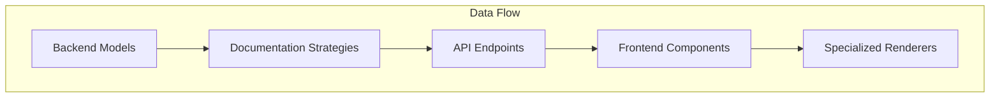
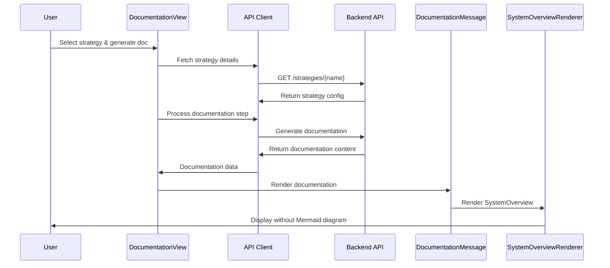

# Documentation System Architecture Guide

## Introduction

This guide provides a comprehensive overview of the documentation system architecture to help you modify the SystemOverviewRenderer component, specifically to remove the Mermaid diagram generation. The architecture is designed with clear separation of concerns, making it possible to make surgical changes with minimal impact on other components.

## System Architecture Overview

The documentation system consists of three main layers that work together:

1. **Backend Models** - Define data structures for documentation content
2. **Documentation Strategies** - Configure the documentation generation process
3. **Frontend Renderers** - Display the documentation content to users



## Detailed Component Relationships

### 1. Backend Models

Models define the structure of documentation data using Pydantic:

```python
# api/documentation/models/basic.py
class SystemOverview(BaseModel):
    """System overview documentation section"""
    architecture_diagram: str = Field(description="Mermaid diagram string")
    core_technologies: List[str]
    design_patterns: List[str]
    system_requirements: List[str]
    project_structure: str
```

```python
# api/documentation/models/api_focused.py
class APIOverview(BaseModel):
    """High-level API documentation overview"""
    title: str
    version: str
    description: str
    base_url: str
    authentication_methods: List[str]
    architecture_diagram: str = Field(description="Mermaid diagram of API architecture")
    core_technologies: List[str]
    # ...other fields
```

### 2. Documentation Strategies

Strategies define steps for generating documentation and link them to models:

```python
# api/documentation/strategies/basic_strategy.py
BASIC_STRATEGY = DocumentationStrategy(
    name="basic",
    description="Basic 5-step documentation strategy",
    steps=[
        StepConfig(
            id=1,
            title="System Overview",
            prompt="Generate a comprehensive system overview...",
            model="SystemOverview",
            # ...
        ),
        # ...other steps
    ],
    models={
        "SystemOverview": models.SystemOverview,
        "ComponentAnalysis": models.ComponentAnalysis,
        # ...other models
    },
)
```

### 3. Strategy Registry

Strategies are registered in a central registry:

```python
# api/documentation/strategies/__init__.py
strategy_registry = {}

def register_strategy(strategy: DocumentationStrategy):
    """Register a documentation strategy"""
    strategy_registry[strategy.name] = strategy
```

### 4. API Endpoints

API endpoints expose strategies and process documentation requests:

```python
# api/routers/strategies.py
@router.get("/{strategy_name}")
async def get_strategy(strategy_name: str) -> SerializedStrategy:
    """Get details of a specific documentation strategy"""
    strategy = strategy_registry.get(strategy_name)
    # ...return strategy details
```

### 5. Frontend Components

The frontend fetches and processes documentation:

```typescript
// components/agent-panel/documentation-view.tsx
const { data: strategyDetails } = useQuery({
  queryKey: ["documentation", "strategy", selectedStrategy],
  queryFn: () => documentationApi.getStrategyDetails(selectedStrategy),
  enabled: !!selectedStrategy,
});

// Process documentation steps
const handleGenerateDoc = useCallback(
  async () => {
    // ...generate documentation for current step
  },
  [
    /* dependencies */
  ]
);
```

### 6. Documentation Message Component

The DocumentationMessage component analyzes content and selects the appropriate renderer:

```typescript
// components/documentation/DocumentationMessage.tsx
const renderContent = (content: any) => {
  if (!content) return null;

  // System overview check
  if (
    matchesContentType(content, [
      "architecture_diagram",
      "core_technologies",
      "design_patterns",
      "system_requirements",
    ])
  ) {
    return <SystemOverviewRenderer content={content} />;
  }

  // API overview check
  if (
    matchesContentType(content, [
      "architecture_diagram",
      "core_technologies",
      "authentication_methods",
    ])
  ) {
    return <APIOverviewRenderer content={content} />;
  }

  // ...other content type checks
};
```

### 7. Specialized Renderers

Each renderer displays a specific type of documentation:

```typescript
// components/documentation/renderers/SystemOverviewRenderer.tsx
export const SystemOverviewRenderer = memo(function SystemOverviewRenderer({
  content,
}: SystemOverviewRendererProps) {
  return (
    <div className="opacity-0 animate-in fade-in duration-200">
      <Card className="p-6 space-y-6">
        <h3 className="text-lg font-semibold">System Overview</h3>

        {/* Architecture Diagram with error boundary */}
        {content.architecture_diagram && (
          <div className="space-y-2">
            <h4 className="font-medium">Architecture</h4>
            <ErrorBoundary fallback={<div>Failed to render diagram</div>}>
              <MermaidDiagram content={content.architecture_diagram} />
            </ErrorBoundary>
          </div>
        )}

        {/* Other content sections */}
        {/* ... */}
      </Card>
    </div>
  );
});
```

## Modifying the SystemOverviewRenderer

To remove the Mermaid diagram from the SystemOverviewRenderer, you need to:

1. **Locate the renderer file**: `components/documentation/renderers/SystemOverviewRenderer.tsx`
2. **Remove or modify the diagram section**: Find the section that renders `content.architecture_diagram` and modify it
3. **Optional backend changes**: If you want to stop generating the diagram data entirely, modify the `SystemOverview` model in `api/documentation/models/basic.py`

### Surgical Change to Remove Mermaid Diagram

```typescript
// Modified SystemOverviewRenderer.tsx
export const SystemOverviewRenderer = memo(function SystemOverviewRenderer({
  content,
}: SystemOverviewRendererProps) {
  return (
    <div className="opacity-0 animate-in fade-in duration-200">
      <Card className="p-6 space-y-6">
        <h3 className="text-lg font-semibold">System Overview</h3>

        {/* Remove or comment out this section to disable the diagram */}
        {/* 
                {content.architecture_diagram && (
                    <div className="space-y-2">
                        <h4 className="font-medium">Architecture</h4>
                        <ErrorBoundary fallback={<div>Failed to render diagram</div>}>
                            <MermaidDiagram content={content.architecture_diagram} />
                        </ErrorBoundary>
                    </div>
                )}
                */}

        {/* Keep the rest of the content sections */}
        <div className="space-y-2">
          <h4 className="font-medium">Core Technologies</h4>
          <ul className="list-disc pl-4">
            {content.core_technologies.map((tech, i) => (
              <li key={i}>{tech}</li>
            ))}
          </ul>
        </div>

        {/* Other sections remain unchanged */}
      </Card>
    </div>
  );
});
```

## Data Flow Diagram



## Key Points for Modification

1. **Component Isolation**: The renderer components are isolated, so changes to one renderer won't affect others
2. **Data Flow**: The data still flows from backend models to frontend renderers, but the rendering logic can be modified
3. **Optional Model Changes**: If you want to stop generating diagram data entirely, you can modify the `SystemOverview` model
4. **Testing**: After modification, test the documentation generation to ensure other components still work correctly

This architecture allows for precise, surgical changes to specific components without disrupting the overall system. By understanding the relationships between components, you can confidently modify the SystemOverviewRenderer to remove the Mermaid diagram functionality.
