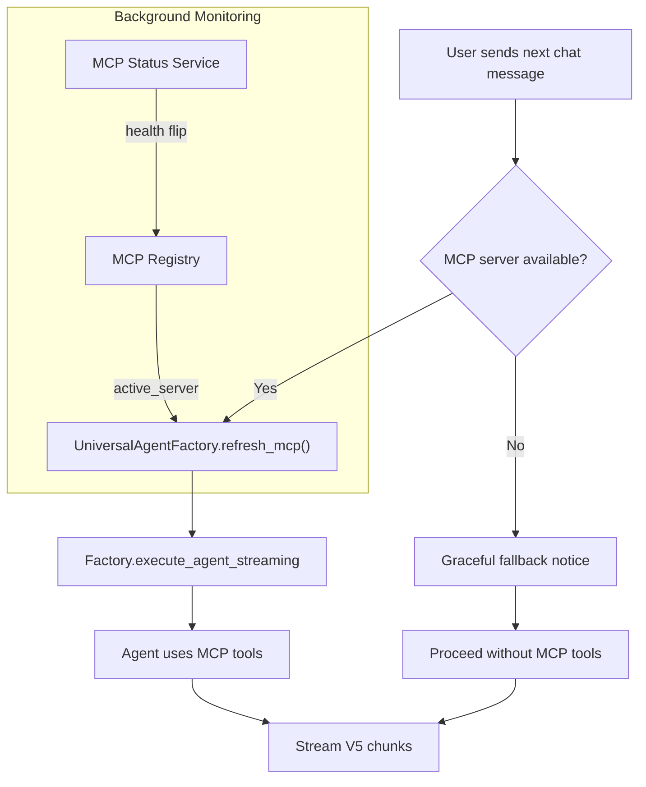

## MCP Hot‑Swap Integration Guide

### Overview

Enable agents to seamlessly regain MCP access on the next user turn without refreshing the chat or recreating agents per request. We do this by making MCP server selection dynamic at run-time via a lightweight registry and calling refresh hooks before each run.

### Architecture Diagram



### Dense Plan (Minimal Text)

| Area          | Change                                                         | Why                                       | Risk | Effort  |
| ------------- | -------------------------------------------------------------- | ----------------------------------------- | ---- | ------- |
| MCP Selection | Add `MCPRegistry` (global, thread-safe)                        | Hot-swap server without recreating agents | Low  | ~30 LOC |
| Factory       | `refresh_mcp()` reads from registry; call once per interaction | Dynamic binding per run                   | Low  | ~10 LOC |
| Lifespan      | Run FastMCP in app lifespan; mount at `/mcp`                   | Stable, restartable server session        | Low  | ~20 LOC |
| Control API   | `POST /api/mcp/register\|deregister`                           | Ops/UI triggers rebinds live              | Low  | ~25 LOC |
| Status        | On health flip, update registry                                | Auto adopt new server                     | Low  | ~10 LOC |
| Chat Path     | Call `factory.refresh_mcp()` in chat utility                   | Zero-refresh user experience              | Low  | 1 LOC   |

### Foldable Code (Copy‑Paste Ready)

<details>
  <summary>api/utils/mcp_registry.py (NEW)</summary>

```python
import asyncio
from typing import Optional
from pydantic_ai.mcp import MCPServerStreamableHTTP

class MCPRegistry:
    def __init__(self) -> None:
        self._lock = asyncio.Lock()
        self._active: Optional[MCPServerStreamableHTTP] = None

    async def register(self, server: MCPServerStreamableHTTP) -> None:
        async with self._lock:
            self._active = server

    async def deregister(self) -> None:
        async with self._lock:
            self._active = None

    @property
    def active_server(self) -> Optional[MCPServerStreamableHTTP]:
        return self._active

_registry = MCPRegistry()

def get_mcp_registry() -> MCPRegistry:
    return _registry
```

</details>

<details>
  <summary>api/agents/universal.py (factory hook)</summary>

```python
# Add near other imports
from api.utils.mcp_registry import get_mcp_registry

class UniversalAgentFactory:
    # ... existing code ...

    def refresh_mcp(self) -> None:
        """Refresh the bound MCP server before each run."""
        registry_server = get_mcp_registry().active_server
        if registry_server is not None:
            self.mcp_server = registry_server

    async def execute_agent_streaming(...):
        # add this line at the top of the method body
        self.refresh_mcp()
        # ... existing code continues ...
```

</details>

<details>
  <summary>api/index.py (lifespan + mount fastmcp)</summary>

```python
from contextlib import asynccontextmanager
from fastmcp import FastMCP
from api.utils.mcp_registry import get_mcp_registry

mcp = FastMCP(name="woolly", stateless_http=True)
app.mount("/mcp", mcp.streamable_http_app())

@asynccontextmanager
async def lifespan(app: FastAPI):
    async with mcp.session_manager.run():
        # make fastmcp available globally
        await get_mcp_registry().register(mcp.streamable_http_client())
        yield
        await get_mcp_registry().deregister()

app = FastAPI(lifespan=lifespan)
```

</details>

<details>
  <summary>api/routers/mcp_control.py (NEW)</summary>

```python
from fastapi import APIRouter, Body
from pydantic_ai.mcp import MCPServerStreamableHTTP
from api.utils.mcp_registry import get_mcp_registry

router = APIRouter()

@router.post("/api/mcp/register")
async def register_mcp(url: str = Body(..., embed=True)):
    server = MCPServerStreamableHTTP(url)
    # Optionally validate the connection here
    await get_mcp_registry().register(server)
    return {"status": "registered", "url": url}

@router.post("/api/mcp/deregister")
async def deregister_mcp():
    await get_mcp_registry().deregister()
    return {"status": "deregistered"}
```

</details>

<details>
  <summary>api/utils/pydantic_chat.py (1‑liner refresh)</summary>

```python
from api.agents.universal import get_universal_factory

async def stream_pydantic_chat(...):
    factory = get_universal_factory()
    factory.refresh_mcp()  # ensure newest server is used
    # ... existing code ...
```

</details>

### Notes

- No per-request agent construction; we reuse the factory but refresh the MCP binding just-in-time.
- If MCP disconnects mid-session, next user turn adopts the new server automatically.
- If registry has no server, behaviour gracefully falls back (current default).

### Test Checklist

- Disconnect MCP → send message → see fallback notice, no crash.
- Reconnect MCP → send next message → tools available, no page refresh.
- Verify `/api/mcp/status` flips and chat headers reflect `X-MCP-Status`.
